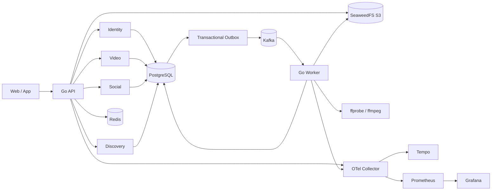

# 系统架构

Sea Music 选择“模块化单体 API + 独立 Worker”的项目形态：投稿、社交和发现需要强一致事务边界，先保留同库内聚；耗时媒体任务和事件消费独立扩缩容。模块只通过公开服务接口、数据库 schema 和版本化事件协作。

## 关键运行链路

1. 客户端创建草稿，API 生成用户隔离的对象 key 和短期 S3 PUT URL。
2. 客户端直传源文件；finalize 读取对象并核验长度、类型和 SHA-256，在同一事务中推进状态并写 Outbox。
3. Dispatcher 只有收到 Kafka ack 后才确认 Outbox；Worker 通过 Inbox 去重并领取带租约的处理任务。
4. Worker 运行真实 ffprobe/ffmpeg，上传 rendition 与封面，将视频推进到审核态；审核通过后才对外可见。
5. 点赞、收藏、关注、评论和弹幕先写权威关系及 Outbox，消费者异步投影计数和热门分数；周期对账修复漂移。
6. 关注、热门、推荐三类 feed 在返回前统一执行发布状态、审核可见性和 block 关系过滤。

## 一致性和降级边界

- PostgreSQL 是身份、投稿状态、社交关系和计数修复的权威来源。
- Outbox/Inbox 提供至少一次投递下的业务幂等；不承诺 broker 端恰好一次。
- Redis 承担限流、热门排序和缓存。热门 Redis 不可用时返回带 `degraded` 标志的数据库结果；安全相关限流失败时拒绝请求。
- Kafka 是 API 的可选 readiness 依赖，已有写请求仍可原子进入 Outbox；数据库、Redis 和对象存储是必需依赖。

完整故障操作见 [故障演练](runbooks/fault-drills.md)，关键决策见 [ADR](adr/0001-modular-monolith.md)，逐模块评审与改进清单见 [后端评审见解](backend-review.md)。
