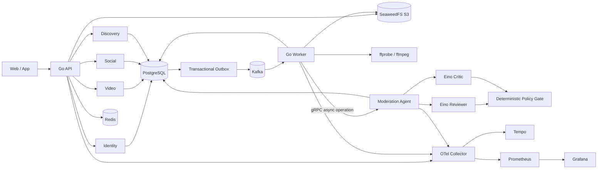

# 系统架构

Sea Music 选择“模块化单体 API + 独立 Worker + gRPC 审核 Agent”的项目形态：投稿、社交和发现保留同库事务边界；媒体任务、事件消费和模型推理解耦扩缩容。模块只通过公开接口、数据库 schema 和版本化事件协作。

## 关键运行链路

1. 客户端创建草稿，API 生成用户隔离的对象 key 和短期 S3 PUT URL。
2. 客户端直传源文件；finalize 读取对象并核验长度、类型和 SHA-256，在同一事务中推进状态并写 Outbox。
3. Dispatcher 只有收到 Kafka ack 后才确认 Outbox；Worker 通过 Inbox 去重并领取带租约的处理任务。
4. Worker 运行真实 ffprobe/ffmpeg，将视频推进审核态，并原子写入 `video.ready_for_moderation` Outbox。
5. 专用 Kafka consumer 在 Inbox 事务内只创建 moderation dispatch job；网络调用在事务外由租约循环执行，通过 gRPC `StartReview/GetReview` 启动和回收长任务。
6. Agent 的 operation 同样支持幂等、租约接管和有界重试。Eino reviewer 提交候选证据，独立 critic 负责反证；Go 策略门禁只接受一致且越过阈值的结论，分歧、低置信度、缺少 provider 或输出异常都不会产生发布授权。
7. 点赞、收藏、关注、评论和弹幕先写权威关系及 Outbox，消费者异步投影计数和热门分数；周期对账修复漂移。
8. 关注、热门、推荐三类 feed 在返回前统一执行发布状态、审核可见性和 block 关系过滤。

## 一致性和降级边界

- PostgreSQL 是身份、投稿状态、社交关系和计数修复的权威来源。
- Outbox/Inbox 提供至少一次投递下的业务幂等；不承诺 broker 端恰好一次。
- Redis 承担限流、热门排序和缓存。热门 Redis 不可用时返回带 `degraded` 标志的数据库结果；安全相关限流失败时拒绝请求。
- Kafka 是 API 的可选 readiness 依赖，已有写请求仍可原子进入 Outbox；数据库、Redis 和对象存储是必需依赖。
- Agent 结果是可审计证据而非授权；只有 video 领域的审核策略能改变发布状态。默认 shadow 模式不自动迁移状态。
- gRPC 本地开发显式允许 plaintext；production 配置校验强制 cert/key/CA 双向 TLS。Agent 的 `/metrics` 提供 RPC QPS、状态码和延迟直方图。

完整故障操作见 [故障演练](runbooks/fault-drills.md)，关键决策见 [ADR](adr/0001-modular-monolith.md)，逐模块评审与改进清单见 [后端评审见解](backend-review.md)。
