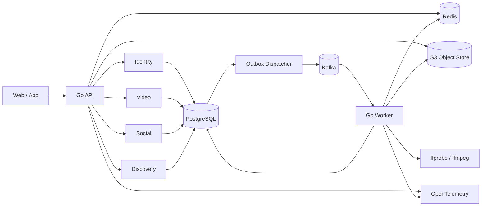
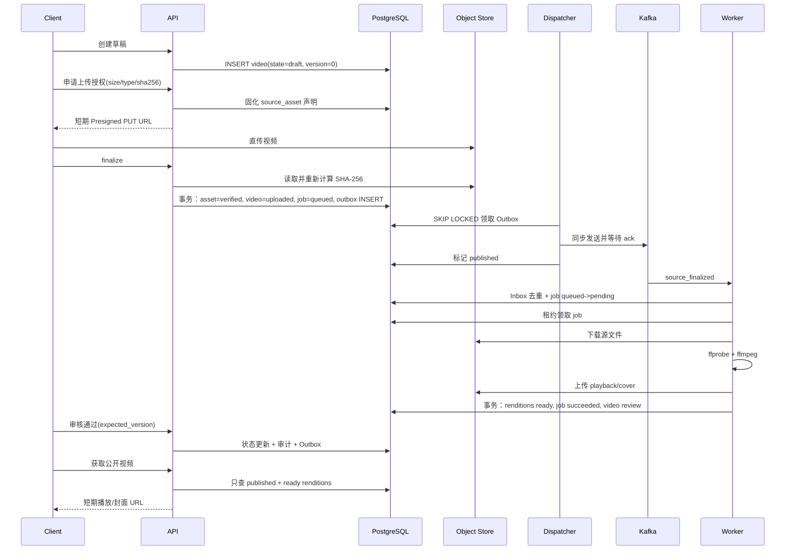

# Sea Music 后端面试学习手册

> 目标：从国内 Go 后端面试的“八股文 + 项目拷打 + 源码追问”角度，真正讲清 Sea Music。本文所有项目结论都以当前仓库源码为准；概念解释用于帮助理解源码，不把项目没有实现的能力包装成已实现。
>
> CAS 只是本文深度标准的一个例子，不是唯一重点。对项目中每个值得面试的机制，本文都尽量回答：它是什么、源码怎样运行、为什么这样选、并发或部分失败时怎样、替代方案是什么、当前实现还缺什么。

## 1. 先把项目讲明白

### 1.1 一句话定位

Sea Music 是一个面向 Bilibili 类 UGC 视频社区核心链路的 Go 后端：采用“模块化单体 API + 独立 Worker”，覆盖身份认证、S3 直传、真实 ffmpeg 媒体处理、审核发布、可靠事件、社交互动、内容发现、限流、可观测性和故障恢复。

### 1.2 技术栈

| 层次 | 技术 | 在项目中的职责 |
|---|---|---|
| 语言与 HTTP | Go 1.26、`net/http` | API、Worker、并发循环、优雅退出 |
| 数据库 | PostgreSQL、pgx | 权威业务数据、事务、行锁、CAS 条件更新、Outbox/Inbox |
| 缓存与实时排序 | Redis | 令牌桶限流、热门 ZSET、计数快照缓存 |
| 消息系统 | Kafka、franz-go | 领域事件异步分发 |
| 对象存储 | S3 API、SeaweedFS | 源视频、转码结果和封面 |
| 媒体处理 | ffprobe、ffmpeg | 媒体合法性探测、H.264/AAC 转码、封面提取 |
| 安全 | Argon2id、HMAC-SHA256 JWT | 密码哈希、访问令牌、刷新令牌轮换 |
| 可观测性 | OpenTelemetry、Prometheus、Grafana、Tempo | HTTP/PG/Redis/Kafka/媒体链路追踪和指标 |
| 工程化 | migration、OpenAPI、真实集成测试、故障演练、压测 | 可重复验证而非只跑 mock |

依赖清单见 `go.mod:1-49`，API 和 Worker 的依赖装配分别见 `cmd/api/main.go:38-138`、`cmd/worker/main.go:37-164`。

### 1.3 架构图



### 1.4 为什么是模块化单体，不直接上微服务

源码事实：API 进程内装配 identity、video、social、discovery；它们使用独立 Go package 和 PostgreSQL schema，架构测试禁止领域包互相直接 import。CPU/IO 密集的媒体任务、事件投影和对账放到独立 Worker。证据见 `internal/architecture/boundaries_test.go:15-67`、`docs/adr/0001-modular-monolith.md`。

面试回答：

> 项目处于核心业务快速迭代阶段，投稿、社交和发现仍明显受益于同库事务和简单本地调试，所以先用模块化单体控制分布式复杂度；媒体转码和事件消费在资源模型、故障域、扩缩容节奏上不同，因此先拆成独立 Worker。等团队所有权或负载边界稳定后，可以沿数据库 schema 和版本化事件拆服务。

关键权衡：

- 收益：部署和调试简单；强一致事务容易；避免过早引入 RPC、服务发现、分布式事务。
- 代价：API 模块共享发布和扩容节奏；同库仍可能形成耦合；架构边界主要靠测试和规范约束。
- 不是“单体没有边界”：package、schema、公开接口、事件契约和架构测试共同表达边界。
- 也不是“已经是微服务”：API 内多个模块仍同进程、同数据库实例，不应包装成微服务项目。

### 1.5 60 秒项目介绍模板

> 我做的是一个 Go UGC 视频社区后端，架构是模块化单体 API 加独立 Worker。核心链路是客户端拿短期 S3 签名 URL 直传，finalize 端重新读取对象并校验大小、类型和 SHA-256，然后在同一个 PostgreSQL 事务里推进视频状态、创建处理任务并写 Outbox。Dispatcher 收到 Kafka ack 后才把 Outbox 标记完成，消费者用 Inbox 去重；媒体 Worker 用 `SKIP LOCKED` 和租约领取任务，真实运行 ffprobe/ffmpeg，完成后进入审核态。审核发布使用版本号冲突检测，并写状态审计与发布事件。点赞等关系以 PostgreSQL 为权威，计数和热门异步投影到 PostgreSQL/Redis，同时通过周期对账修复漂移。项目还覆盖 refresh token 轮换重放检测、Redis Lua 令牌桶、游标分页、OpenTelemetry 和真实故障演练。

面试时不要一口气展开所有点。先给主链路，让面试官选择 CAS、Outbox、任务租约、鉴权、缓存或压测继续追问。

### 1.6 阅读每个机制时统一使用六层模型

| 层次 | 必须回答的问题 | 只会这一层的风险 |
|---|---|---|
| L1 定义 | 这个概念是什么 | 只会背八股 |
| L2 项目落地 | 入口、关键 SQL/数据结构、调用链在哪 | 无法证明真正做过 |
| L3 正确性 | 它维护了什么不变量，原子边界在哪里 | 只会 happy path |
| L4 故障模型 | 超时、重复、崩溃、乱序、并发时怎样 | 项目深度不足 |
| L5 权衡 | 为什么不用替代方案，付出什么代价 | 像照着教程实现 |
| L6 演进 | 数据量或团队扩大后先改什么，如何验证 | 缺少工程判断 |

后文的 CAS、Outbox、租约、JWT、Redis Lua、对象签名、计数投影、热门衰减、游标分页和缓存都按这套模型展开。面试回答不要求每次把六层全部说完，但必须准备好沿追问逐层下钻。

## 2. 项目主链路：一次视频如何从草稿变成可播放内容

### 2.1 业务时序



### 2.2 状态机

状态定义和合法边见 `internal/video/state.go:9-58`。

| 当前状态 | 可到达状态 | 含义 |
|---|---|---|
| `draft` | `uploaded`、`withdrawn` | 已建稿，等待合法源文件 |
| `uploaded` | `processing`、`failed`、`withdrawn` | 源文件已核验 |
| `processing` | `review`、`failed`、`withdrawn` | Worker 正在处理 |
| `review` | `published`、`failed`、`withdrawn` | 等待审核 |
| `published` | `withdrawn` | 已公开，只允许撤稿 |
| `failed` | `processing`、`withdrawn` | 可重试处理或撤稿 |
| `withdrawn` | 无 | 终态 |

状态机的价值不是“代码好看”，而是把业务不变量集中表达：未转码不能审核，未审核不能发布，撤稿后不能偷偷恢复。数据库还有 `CHECK` 约束防止写入未知状态，见 `internal/platform/migrate/migrations/0005_video_core.sql:1-18`。

需要注意：部分内部 Worker 状态推进直接在事务代码里完成，并未全部调用 `Video.Transition`，例如 `internal/video/jobs.go:156-247`。因此领域状态表和数据库事务实现必须共同维护；这是可继续演进的地方。

### 2.3 为什么客户端直传对象存储

API 只签发带对象 key、内容类型、SHA-256 metadata 和 TTL 的 Presigned PUT URL，见 `internal/video/objectstore.go:78-88`。

好处：

- 视频大文件不经过 API 请求体，避免 API 带宽、连接数、内存和临时磁盘成为上传瓶颈。
- 对象存储天然适合大对象、分片上传、容量扩展和 CDN 衔接。
- 用户对象 key 是服务端生成的 `sources/{creator}/{video}/source`，不能任意覆盖其他对象。

为什么签名 URL 仍不可信：签名只能证明客户端在限制内完成了一次对象操作，不能证明内容真的是声明的视频。因此 `Finalize` 会读取对象，核对实际长度、Content-Type 和实际 SHA-256；不一致就把 asset 标成 `rejected`。见 `internal/video/upload.go:92-109`、`internal/video/objectstore.go:139-157`。

项目边界：finalize 当前会把整个对象流过 API 来计算哈希，最大允许 10 GiB。它避免了“上传流量经 API”，但校验流量仍经 API；大规模系统可考虑对象存储原生 checksum、异步校验服务、分块哈希或可信上传清单，不能说本实现完全消除了大文件带宽压力。

#### Presigned URL 的机制是什么

Presigned URL 是服务端用对象存储凭证对“HTTP 方法、bucket、object key、有效期及部分请求信息”签名后生成的临时授权。客户端拿到 URL 后直接请求对象存储，不获得长期 AccessKey/SecretKey。项目调用 AWS SDK 生成 `PutObject` 签名，并把 Content-Type 和 `sha256` metadata 放入待签请求，见 `internal/video/objectstore.go:78-88`。

它解决的是临时授权和流量旁路，不是内容真实性：

- URL 泄露后，在过期前持有者可能使用它；TTL 只是缩小风险窗口，不是一次性消费证明。
- metadata 中的 SHA-256 是客户端声明，S3 不会因为字段名叫 sha256 就自动替服务端验证内容。
- URL 通常无法在签发后单独撤销，除非修改凭证/策略、删除对象或使用额外代理控制。
- 服务端必须固定 key，不能允许客户端任意传入 bucket/key，否则可能越权覆盖其他对象。

#### `Inspect -> FinalizeUpload` 是否存在竞态

存在一个当前实现没有完全封死的 TOCTOU（time-of-check to time-of-use）窗口：

1. API 用 `GetObject` 读取并校验对象 A 的大小、类型和 SHA-256。
2. 校验完成后，API 才进入 `FinalizeUpload` 的数据库事务。
3. 如果原上传 URL 仍有效且允许覆盖同一个 key，客户端可能把该 key 替换成对象 B。
4. Worker 以后按 key 下载时只检查长度上限，没有再次比对数据库记录的 SHA-256，可能处理 B。

源码边界分别在 `internal/video/upload.go:92-109`、`internal/video/objectstore.go:139-157,167-191`。数据库行锁无法锁住 S3 对象，因此把 DB 事务包得更大也解决不了跨系统竞态。

可选修复：

- 每次 grant 使用不可预测、不可复用的新 object key；验证后复制/移动到不可写的 sealed key，Worker 只读 sealed key。
- 启用对象版本，校验时记录 VersionID/ETag，Worker 按特定版本读取；但 ETag 不总等于内容 MD5，尤其是分片上传。
- Worker 下载时重新计算 SHA-256，并与数据库声明比较；代价是多一次哈希 CPU，但本来就要流式下载。
- 使用对象存储原生 checksum 条件和禁止覆盖策略，同时验证实际返回 checksum。

这是当前项目需要诚实承认的安全/正确性边界，不应因为 finalize 有 SHA-256 就声称“对象之后绝不可能变化”。

### 2.4 finalize 如何做到幂等

`FinalizeUpload` 在事务里锁住 video 和 source asset：

- asset 为 `pending` 时，第一次将其改成 `verified`，视频 `draft -> uploaded`，版本加一，写状态审计。
- 处理任务按 `(source_asset_id, config_version)` 唯一，使用 UPSERT 后返回同一个 job ID。
- 只有 `newlyFinalized` 为真时才写 `video.source_finalized` Outbox，并把 event ID 关联回 asset。
- 重复 finalize 看到 `verified`，不重复推进状态、不重复发事件，仍返回原 job。

源码见 `internal/video/postgres.go:215-286`，唯一约束见 `0005_video_core.sql:51-70` 和 `0008_video_event_activation.sql:5-6`。

八股：幂等是“同一个操作执行一次或多次，对业务最终效果相同”，不等于每次响应字节完全一样。常见实现包括唯一键、幂等键、状态机条件更新、去重表。本项目组合使用状态判断、唯一约束和 UPSERT。

#### 幂等与并发安全不是同义词

幂等描述重复调用的效果；并发安全描述多个操作交错时是否仍维护不变量。项目同时需要两者：

- `source_assets.video_id UNIQUE` 和行锁确保一个视频只有一个 source asset。
- `processing_jobs(source_asset_id, config_version) UNIQUE` 确保并发 finalize 也只有一个逻辑任务。
- `newlyFinalized` 控制只发一次 source_finalized 事件。

如果只有应用层 `if status == pending` 而没有行锁/唯一约束，两个并发请求都可能读到 pending 并重复创建副作用；所以“写了状态判断”本身不能证明并发幂等。

## 3. CAS、乐观锁、悲观锁与本项目的真实实现

这是最容易被项目拷打的部分。

### 3.1 CAS 到底是什么

CAS 是 Compare-And-Swap（比较并交换）：只有当共享位置当前值仍等于我先前观察到的旧值时，才把它替换成新值，否则失败。

抽象语义：

```text
CAS(address, expected, new):
    if *address == expected:
        *address = new
        return success
    return failure
```

CPU 原子指令里的 CAS 是单个内存位置上的原子读改写；数据库里的“CAS 思想”通常通过条件更新实现：

```sql
UPDATE video.videos
SET state = $new_state, version = version + 1
WHERE id = $id AND version = $expected_version;
```

如果 `RowsAffected = 1`，比较成功并完成更新；如果为 0，说明记录不存在或版本已改变，调用者持有的是旧快照。

### 3.2 什么是乐观锁

乐观锁不是一种真实的数据库锁类型，而是一种并发控制策略：假设冲突不频繁，读取时不长期持有排他锁，写入时用版本号或时间戳验证“从读到写期间数据是否被别人改过”。冲突后通常返回失败、重读再决策，或在安全时有限重试。

典型流程：

1. 读到 `version=3`。
2. 根据版本 3 的数据做业务判断。
3. 执行 `WHERE version=3` 的条件更新并令版本变成 4。
4. 影响 0 行说明发生冲突。

适合读多写少、冲突概率低、临界区不能长时间持锁的场景。冲突高时会出现大量失败和重试，悲观锁可能更合适。

### 3.3 什么是悲观锁

悲观锁假设冲突很可能发生，先锁住记录再读改写。PostgreSQL 的：

```sql
SELECT ... FROM video.videos WHERE id = $1 FOR UPDATE;
```

会取得行级锁，使其他需要修改或 `FOR UPDATE` 同一行的事务等待，直到当前事务提交或回滚。好处是临界区内状态稳定；代价是等待、死锁风险、吞吐下降，绝不能把慢网络/ffmpeg 调用放在持锁事务里。

### 3.4 Sea Music 是纯乐观锁吗

不是。`PostgresRepository.Transition` 是“悲观行锁 + 版本校验 + CAS 条件更新”的混合方案：

1. 开启事务。
2. `selectVideoForUpdate` 执行 `SELECT ... FOR UPDATE`，锁住视频行，见 `internal/video/postgres.go:304-322`。
3. 内存中的 `Video.Transition(expectedVersion, target)` 检查客户端版本和状态机合法性，见 `internal/video/state.go:49-58`。
4. SQL 再执行 `WHERE id=$1 AND version=$2` 的条件更新，检查 `RowsAffected == 1`，见 `internal/video/postgres.go:70-106`。
5. 同一事务写状态审计；发布/撤稿还写 Outbox；最后提交。

为什么仍保留两层校验：

- 行锁保证当前事务内读取、状态校验、审计和 Outbox 组合更新时，其他写者不能插队。
- `expectedVersion` 表达 API 层“我基于哪个版本做决定”，可拒绝旧页面或旧请求。
- SQL 的版本谓词是最后一道防御，也明确表达 CAS 语义。
- 审计和 Outbox 与状态更新同事务，要么全成，要么全回滚。

更准确的面试表达：

> 审核和撤稿接口要求客户端提交 `expected_version`。仓库层先 `FOR UPDATE` 锁行，再检查期望版本和合法状态，最后用 `WHERE version = expectedVersion` 更新并检查影响行数。它包含乐观并发控制的版本/CAS语义，但实现上同时用了悲观行锁，不是纯乐观锁。冲突返回 HTTP 409，不自动重试，因为审核或撤稿属于有业务语义的人工决定，应该让调用方刷新后重新决策。

HTTP 409 映射见 `internal/appapi/video.go:130-146`，集成测试见 `internal/video/state_integration_test.go:16-47`。

### 3.5 两个请求同时审核会发生什么

假设视频是 `review/version=3`，A 审核通过，B 审核拒绝，两者都带 `expected_version=3`：

1. A 先取得行锁，检查通过，更新为 `published/version=4`，写审计和 Outbox，提交。
2. B 随后取得行锁，此时读到版本 4。
3. `current.Transition(3, failed)` 首先返回 `ErrVersionConflict`。
4. B 的事务回滚，HTTP 返回 409；不会覆盖 A 的发布结果，也不会产生错误审计或事件。

### 3.6 ABA 问题是否适用

ABA 指某值从 A 变成 B 又变回 A，CAS 只比较值会误以为从未变化。项目不只比较 `state`，还比较单调递增的 `version`：即使状态逻辑上回到原值，版本也已经改变，所以旧请求仍会冲突。这正是版本号比只比较业务状态更稳的原因。

项目状态机实际上不允许任意回退，但版本号仍为未来扩展和并发审计提供了更强语义。

### 3.7 纯乐观锁和当前方案如何取舍

可以改成先普通读，然后单条：

```sql
UPDATE video.videos
SET state = $target, version = version + 1
WHERE id = $id AND version = $expected AND state = $source
RETURNING ...;
```

优点是减少锁持有时间和往返，冲突低时吞吐更好。难点是本项目还要原子写状态审计和 Outbox，且错误需要区分“不存在、版本冲突、非法状态”，实现会更复杂。当前方案偏正确性和可解释性；若状态写热点变高，应基于冲突率、锁等待和事务时长再优化，而不是背一句“乐观锁性能更高”。

## 4. 数据库、事务与索引八股落地

### 4.1 ACID 在本项目中的体现

- Atomicity 原子性：视频发布、状态审计、Outbox 同事务；任一步失败全部回滚。
- Consistency 一致性：状态 `CHECK`、唯一键、外键、非负计数约束共同维护不变量。
- Isolation 隔离性：行锁、唯一索引和条件更新处理并发；项目使用 PostgreSQL 默认隔离级别（通常是 Read Committed），没有显式设置更高隔离级别。
- Durability 持久性：事务提交后业务行和 Outbox 都落 PostgreSQL；Kafka 暂时不可用也不会丢待发送事件。

注意：ACID 的 C 指数据库从一个满足约束的状态到另一个满足约束的状态，不是 CAP 里的 Consistency。

### 4.2 默认 Read Committed 能保证什么

PostgreSQL Read Committed 下，每条语句看到其开始时已经提交的数据；同一事务内两次普通 SELECT 可能看到不同结果。`SELECT FOR UPDATE` 会锁定并在等待后基于最新可见版本返回行。本项目需要稳定修改的地方显式用行锁，而不是误以为开启事务就自动避免并发问题。

### 4.3 `FOR UPDATE SKIP LOCKED` 为什么适合任务队列

处理任务领取见 `internal/video/jobs.go:29-64`，Outbox 批量领取见 `internal/events/dispatcher.go:44-94`：候选行使用 `FOR UPDATE SKIP LOCKED`，随后在一条 CTE UPDATE 中写入 owner 和 lease。

- `FOR UPDATE` 防止同一行同时被两个 Worker 领取。
- 普通 `FOR UPDATE` 遇到已锁行会等待，多个 Worker 可能在队头串行阻塞。
- `SKIP LOCKED` 跳过其他事务已锁的行，去取下一条，提升队列并发度。
- 它适合“任一可用任务都可以处理”的队列，不适合必须读取完整一致集合的普通业务查询。
- `ORDER BY available_at, created_at, id` 提供近似公平，但 `SKIP LOCKED` 不承诺严格 FIFO，长事务可能让某行暂时饥饿。

### 4.4 租约是什么，为什么不能只写 `processing=true`

租约是有过期时间的临时所有权。本项目领取任务时写 `lease_owner` 和 `lease_until`；只有 owner 匹配且租约未过期才能续约、完成或失败。Worker 处理时每隔租期的三分之一续约，见 `internal/video/processing.go:182-230`。

如果 Worker 领取后宕机：永久 `processing=true` 会让任务永远卡死；租约过期后其他 Worker 可重新领取。代价是至少一次执行：旧 Worker 卡顿后恢复、新 Worker又接手时，可能发生重复计算。因此还需要：

- 完成写入带 owner/lease 条件，旧 Worker失去提交资格。
- rendition 使用 `(source_asset_id, config_version, kind)` 唯一键和 UPSERT。
- 对象 key 包含 asset 和 config version，重复上传覆盖同一逻辑输出。
- 任务尝试次数有上限，耗尽后进入 failed。

租约不是分布式锁的万能替代品；它依赖数据库时间判断、合理 TTL 和幂等副作用设计。

### 4.5 为什么慢任务不放在数据库事务里

`RunOnce` 只在领取、开始、完成/失败时开短事务；真正下载和 ffmpeg 在事务外运行。否则长事务会：

- 长期占用数据库连接和行锁。
- 增大死锁和锁等待概率。
- 阻碍 vacuum 清理旧版本，导致表膨胀。
- 让网络/CPU故障扩大为数据库并发故障。

### 4.6 唯一索引如何实现业务幂等

| 业务 | 唯一性 | 作用 |
|---|---|---|
| 点赞 | `(user_id, video_id)` 主键 | 一个用户对一个视频最多一条关系 |
| 关注 | `(follower_id, followee_id)` 主键 | 重复关注不增加第二行 |
| 处理任务 | `(source_asset_id, config_version)` | 同一配置只创建一个任务 |
| rendition | `(source_asset_id, config_version, kind)` | 重试不生成重复逻辑产物 |
| Inbox | `(consumer_name, event_id)` | 每个消费者对一个事件只应用一次副作用 |
| DLQ | `(consumer_name, event_id)` | 同一毒消息只隔离一次 |

应用层的“先查再插”存在 TOCTOU 竞态；唯一约束才是并发下最后防线。应用层负责把唯一冲突转换成业务语义。

### 4.7 为什么使用 keyset/cursor 分页而不是 OFFSET

关注 feed 用 `(published_at, id)`，评论用 `(created_at, id)`，弹幕用 `(position_ms, id)` 作为复合游标。以关注流为例：

```sql
WHERE (v.published_at, v.id) < ($cursor_time, $cursor_id)
ORDER BY v.published_at DESC, v.id DESC
LIMIT $limit_plus_one;
```

源码见 `internal/discovery/feed.go:56-107`。

相对 OFFSET：

- 深分页不需要扫描并丢弃前 N 行。
- 新数据插到第一页时，旧游标仍从稳定边界继续，较少重复/漏读。
- `id` 是时间相同情况下的稳定 tie-breaker。
- 缺点是不能随意跳到第 1000 页，游标应视为不透明契约。

当前游标只是 Base64(JSON)，不是加密或签名；服务端会校验结构，但客户端可构造合法边界。这对普通分页通常可接受，如游标携带敏感字段或计费状态则应签名。

### 4.8 索引为什么这样建

- `videos_published_cursor_idx (published_at DESC, id DESC) WHERE state='published'`：部分索引更小，匹配公开 feed 的过滤和排序。
- `processing_jobs_claim_idx (available_at, created_at) WHERE state='pending'`：匹配待处理任务领取。
- `outbox_pending_idx (available_at, occurred_at, id) WHERE state='pending'`：匹配 Dispatcher 扫描顺序。
- `comments_top_level_cursor_idx` 与 `comments_replies_idx`：顶级评论和回复的查询形态不同，分开索引。
- `danmaku_window_idx (video_id, position_ms, id) WHERE visible`：匹配视频时间窗口和游标。

面试时不能只说“加索引提高查询速度”，要说清 where、order by、基数、部分索引大小、写放大和维护成本。所有 DDL 在 `internal/platform/migrate/migrations/`。

### 4.9 migration 为什么加 advisory lock 和 checksum

`migrate.Apply` 使用固定 PostgreSQL advisory lock，避免多个实例启动时并发应用迁移；每个迁移在独立事务中执行；已应用版本会比对 SHA-256 checksum，防止历史 migration 被悄悄改写。见 `internal/platform/migrate/migrate.go:83-143`。

advisory lock 是应用自定义语义的数据库锁，数据库不知道数字 `736241903` 代表迁移；团队必须统一 key。session 级 advisory lock 需要同一物理连接，因此实现先 `database.Conn(ctx)` 固定连接。

### 4.10 `sql.DB` 是连接还是连接池

`database/sql.DB` 是并发安全的连接池句柄，不代表一条固定连接。项目设置最大打开 20、最大空闲 10、连接最长存活 30 分钟，见 `internal/platform/config/config.go:127-132`、`cmd/api/main.go:141-157`。

- `QueryContext/ExecContext` 从池中借连接，用完归还。
- `BeginTx` 后 `*sql.Tx` 固定占用一条连接直到 commit/rollback，因此长事务会耗尽池。
- `database.Conn(ctx)` 显式固定一条连接，migration 的 session advisory lock 正需要这种语义。
- `MaxOpenConns` 过小会排队，过大会压垮数据库；应结合 DB `max_connections`、实例数、查询时长和 `DB.Stats()` 调整。
- 必须关闭 `Rows`，否则连接可能不能及时归还。项目查询普遍 `defer rows.Close()`，同时检查 `rows.Err()`。

连接池满时新增请求不是自动失败，而是等待可用连接或 context 超时。面试排障要观察 open/in_use/idle、WaitCount/WaitDuration、慢 SQL 和事务时长，不能只盯 CPU。

## 5. Transactional Outbox / Inbox 与可靠消息

### 5.1 为什么“先写数据库，再发 Kafka”会丢消息

有两个不能由普通本地事务原子覆盖的系统：PostgreSQL 和 Kafka。

- 先提交数据库，再发 Kafka：数据库成功后进程崩溃，事件永久丢失。
- 先发 Kafka，再提交数据库：消费者可能看到一个最终回滚的业务事件。
- 两边都重试：仍存在中间崩溃窗口，还会重复发送。

这叫双写一致性问题。普通数据库事务不能让 Kafka 一起原子提交。

### 5.2 Outbox 怎样解决

业务数据和待发送事件行写入同一个 PostgreSQL 事务：

```text
BEGIN
  UPDATE business_data ...
  INSERT INTO eventing.outbox ...
COMMIT
```

提交成功则二者都存在；回滚则二者都不存在。独立 Dispatcher 后续扫描 Outbox 并发送 Kafka。核心代码：

- 写 Outbox：`internal/events/repository.go:33-60`
- 视频状态与 Outbox 同事务：`internal/video/postgres.go:107-127`
- 领取与租约：`internal/events/dispatcher.go:44-94`
- 等 Kafka ack：`internal/events/dispatcher.go:166-180`
- ack 后标记完成：`internal/events/dispatcher.go:96-115`

### 5.3 为什么仍然会重复投递

经典 ack window：

1. Dispatcher 已把消息成功写入 Kafka。
2. 还没来得及把 Outbox 标为 `published` 就崩溃。
3. 租约过期，另一个 Dispatcher 再次发送同一事件。

所以 Outbox 保证“事件最终不会因双写窗口丢失”，但通常是至少一次投递，不是恰好一次。项目用稳定 `event_id` 重发同一 Envelope，测试见 `internal/events/recovery_integration_test.go:14-77`。

### 5.4 Inbox 怎样去重

每个消费者在同一个数据库事务里：

1. `INSERT INTO inbox(consumer_name, event_id) ... ON CONFLICT DO NOTHING`。
2. 插入 0 行说明已处理，直接返回。
3. 首次插入则执行 handler 副作用。
4. Inbox claim 和副作用一起 commit；handler 失败则一起 rollback，下次可重试。

见 `internal/events/inbox.go:21-56`。

为什么主键包含 `consumer_name`：同一事件需要被计数投影、热门投影、媒体激活等不同消费者各处理一次；不能用全局 event ID 把其他消费者误判为重复。

### 5.5 为什么不宣称端到端 exactly-once

“Kafka 恰好一次”常局限在 Kafka 内的消费—生产事务；本项目副作用写 PostgreSQL、Redis、S3，跨系统仍不能天然组成单一原子事务。项目提供的是：

- Outbox：业务提交后事件至少能被发送。
- 稳定 event ID + Inbox：数据库副作用业务幂等。
- 唯一约束/UPSERT：重复执行的最后防线。
- Redis/S3：允许可修复或可覆盖的重复副作用。

准确说法是“至少一次传递 + 业务幂等，达到对关键数据库副作用的 effectively-once 效果”，不是端到端物理恰好一次。

### 5.6 指数退避、重试上限和 DLQ

Dispatcher 失败后使用 `1s << min(attempt-1, 8)` 退避；消费者也按基础间隔左移指数退避。指数退避减少依赖故障时的请求风暴。生产系统通常还会加随机抖动 jitter，避免多实例同时醒来；当前实现没有 jitter，是可改进点。

消费者超过重试预算后写 `dead_letters`，并向 `.dlq` topic 写 `eventing.dead_lettered`；Kafka offset 只在隔离成功后提交。管理员可重放，见 `internal/events/consumer.go:50-97,104-152`、`internal/events/replay.go:26-68`。

DLQ 不是垃圾桶：需要告警、可检索错误上下文、修复后重放、重放审计和积压指标。

### 5.7 为什么 Kafka 是 optional readiness

API 的必要依赖是数据库、Redis、对象存储；Kafka 只在 optional map 中，见 `cmd/api/main.go:125-135`。因为业务写仍可原子进入 Outbox，短暂 broker 故障不必拒绝所有写请求；积压恢复后 Dispatcher 会补发。

但这不是无限容忍：Outbox 表会增长、异步处理延迟上升，所以必须监控 pending、publishing、failed 和 oldest event age。项目在 `/metrics` 暴露这些指标，见 `internal/appapi/ratelimit.go:92-100`。

### 5.8 Kafka 的 topic、partition、consumer group 和 offset

- Topic 是逻辑消息流；partition 是可并行、持久化的有序日志分片。
- 顺序只在单个 partition 内成立，不存在天然全 topic 全局顺序。
- Consumer group 内，一个 partition 同一时刻只分配给一个 consumer；增加 consumer 最多扩展到 partition 数，超出的 consumer 会空闲。
- 不同 group 会各自消费完整消息流。项目媒体激活、社交计数、热门排行使用三个不同 group，所以同一领域事件可分别驱动三种投影，见 `cmd/worker/main.go:107-133`。
- Offset 是 group 对 partition 的消费进度。项目在 Inbox 处理成功后显式 `CommitRecords`；毒消息成功隔离到 DLQ 后才提交，见 `internal/events/consumer.go:50-97`。

项目每次 `PollRecords(ctx, 1)` 只取一条，语义简单但吞吐有限。扩展可增大批量、增加 consumer 实例和 partition 数，但批量提交必须重新设计错误隔离和部分成功语义。

### 5.9 消息顺序和 aggregate version

Producer 把 `AggregateID` 放进 record key，Envelope 还带 `AggregateVersion`，见 `internal/events/dispatcher.go:171-177`。设计意图是为同一聚合的稳定路由和顺序判断提供信息，但最终 partition 行为还受 producer partitioner 和 topic 配置影响。

即使同一聚合进入同一 partition，重试、DLQ 重放和多 topic 仍可能让业务观察到旧事件。当前消费者用 event ID 去重，但没有实现“缓存下一版本、检测缺口、拒绝倒序”的严格聚合版本控制。因此准确说法是“事件携带 aggregate version 便于演进和诊断”，不能说已经解决所有乱序。

### 5.10 Kafka offset 提交后还能重复吗

能。消费者可能在数据库事务提交后、offset 提交前崩溃，重启后会再拉到同一 record；rebalance 和提交失败也可能造成重取。Inbox 正是用来覆盖这个窗口。反过来，如果先提交 offset 再做数据库副作用，崩溃会造成消息丢处理，所以项目坚持先副作用成功、后提交 offset。

### 5.11 Dispatcher 每个崩溃点分别会怎样

| 崩溃位置 | 数据状态 | 恢复方式 | 是否可能重复 |
|---|---|---|---|
| 业务事务提交前 | 业务行和 Outbox 一起回滚 | 客户端重试 | 由业务幂等处理 |
| 业务提交后、Dispatcher 领取前 | Outbox=`pending` | 后续轮询领取 | 否 |
| 领取后、发送 Kafka 前 | Outbox=`publishing` 且有 lease | lease 过期后重新领取 | 尚未发送，不重复 |
| Kafka 未确认时超时 | 不知道 broker 是否实际写入 | 记录失败或租约后重试 | 可能重复 |
| Kafka ack 后、MarkPublished 前 | Kafka 已有记录，Outbox 仍 publishing | lease 过期重发 | 必然可能重复 |
| MarkPublished 后 | Outbox=`published` | 无需恢复 | 正常不再发送 |

这里最关键的是“不确定结果”：网络超时不等于操作没发生。分布式系统中不能靠捕获一个 error 推断远端状态，只能用幂等 ID、状态查询或补偿把不确定性收敛。

`RunOnce` 当前逐条同步发送，一条失败就返回；同批次已经 claim 但还没处理的后续事件会保持 publishing，直到 lease 过期再领取，见 `internal/events/dispatcher.go:203-230`。好处是逻辑简单，代价是故障时会放大尾部延迟；可改为逐条释放未处理 lease、缩小 claim batch、并行发送或记录每条结果，但必须维持每条事件的 owner 条件。

### 5.12 为什么 MarkPublished 还要检查 lease owner

旧 Dispatcher 可能因长暂停失去租约，新 Dispatcher 已重新领取同一事件。如果旧实例恢复后无条件 UPDATE，它会误把新实例正在处理的事件标完成。项目的条件是：

```sql
WHERE id = $eventID AND state = 'publishing' AND lease_owner = $dispatcherID
```

影响行数不是 1 就返回 `outbox delivery lease lost`，见 `internal/events/dispatcher.go:96-143`。这相当于 fencing 的简化形式：owner 身份阻止明显旧持有者提交。

严格分布式 fencing 常使用单调递增 token，而不仅是 owner 字符串。若同一 dispatcher ID 被错误复用，字符串 owner 的隔离能力会下降；项目用 hostname+pid 生成 worker ID，已降低但没有数学消除复用可能。

### 5.13 DLQ 重放本身是否恰好一次

不是。`ReplayService.Replay` 先直接发布原 Envelope，再执行：

```sql
UPDATE dead_letters SET status='replayed'
WHERE id=$1 AND status='quarantined';
```

见 `internal/events/replay.go:26-68`。若发布成功后进程崩溃，DLQ 仍是 quarantined，再次重放会重复发布；两个管理员并发点击也可能都先发布，最后只有一个成功更新状态。

数据库消费者仍能靠稳定 event ID + Inbox 去重，所以关键数据库副作用不重复，但外部非幂等消费者仍可能受影响。更严谨的方案是把“重放请求”先用 CAS 状态改成 `replaying` 并写新的 Outbox，由 Dispatcher 统一发送；成功后再标 replayed，同时保留原 event ID 或显式 replay ID/causation ID。

### 5.14 Inbox 为什么不能先插入并单独提交

若 Inbox claim 先提交，handler 副作用随后失败，重试会看到 Inbox 已存在并跳过，形成永久丢处理。若副作用先提交、Inbox 后提交，崩溃又会重复副作用。因此两者必须处于同一个数据库事务。

这个原子边界只覆盖同一 PostgreSQL 内的副作用。Redis、S3、第三方 HTTP 不会自动随事务回滚；这些外部副作用必须幂等、可覆盖、可对账，或通过新的 Outbox 再异步执行。

## 6. Worker 并发、任务恢复与 Go 八股

### 6.1 Worker 内有哪些并发循环

`cmd/worker/main.go:136-164` 启动六个 goroutine：媒体处理、计数对账、媒体激活消费者、计数消费者、热门消费者、Outbox Dispatcher，并用 `sync.WaitGroup` 等待退出。

这体现了：

- goroutine 是由 Go runtime 调度的轻量并发执行单元，不等于 OS 线程。
- channel 用在媒体租约续约结果回传；WaitGroup 用于生命周期汇合。
- 根 context 由 SIGINT/SIGTERM 取消，所有循环观察 `ctx.Done()` 后退出。
- HTTP server 使用带超时的 `Shutdown` 做有界优雅退出，见 `internal/platform/httpserver/server.go:24-50`。

### 6.2 context 是什么，不应怎么用

context 用来传播取消、截止时间和请求范围元数据。本项目：

- HTTP 请求 context 传到数据库、Redis、S3。
- 媒体处理用 `context.WithTimeout` 限制最长 10 分钟。
- 租约续约失败时 cancel 媒体处理。
- 请求 ID 和 Principal 放在 context。

不应把 context 存进长期结构体、不应传 nil、不应把可选业务参数都塞进 context。取消是协作式的：被调用代码必须实际监听 context 或使用支持 context 的 API。

### 6.3 channel 为什么是缓冲 1

`renewed := make(chan error, 1)` 让续约 goroutine 可以在主流程尚未开始接收时写回一次最终结果，不因发送阻塞而泄漏。协议规定只发送一次，然后主流程在 cancel 后必读一次。若无缓冲且主流程在某条错误路径不读，发送方可能永久阻塞。

### 6.4 `sync.Mutex` 与 `RWMutex` 在项目中的选择

S3 下载 URL 缓存用普通 `sync.Mutex`，见 `internal/video/objectstore.go:38-45,90-130`；限流 metrics 用 `RWMutex`，见 `internal/platform/ratelimit/ratelimit.go:120-157`。

- URL 缓存读命中也涉及“检查过期”这一组合操作，且实现追求简单；普通 Mutex 足够。
- metrics Snapshot 是纯读，更新是写，RWMutex 允许多个快照读取并发。
- RWMutex 不是必然更快；读临界区很短、竞争低时额外复杂度可能无收益。选择应基于读写比例和 profile。

### 6.5 任务重复执行时对象存储副作用怎么办

输出 key 是 `renditions/{sourceAssetID}/v{configVersion}/playback.mp4` 和 `cover.jpg`，重试写相同逻辑位置；数据库 rendition 用唯一键 UPSERT。因此重复计算浪费 CPU/IO，但不会无限制造新业务记录。

仍有边界：S3 上传和数据库完成事务不是原子的。如果文件已上传而 DB 提交失败，会留下暂时孤儿对象；重试会覆盖同 key。真实生产还应有对象清理/标记清扫机制。

### 6.6 GMP 调度模型怎么联系到本项目

Go 调度器常用 GMP 描述：

- G（goroutine）：待执行任务及其栈、状态等。
- M（machine）：实际执行 Go 代码的 OS 线程。
- P（processor）：执行 Go 代码所需的逻辑处理器，维护本地可运行队列；数量通常由 `GOMAXPROCS` 决定。

调度器会使用本地/全局队列、work stealing、网络轮询和 syscall 处理来让 G 在 M/P 上运行。goroutine 阻塞在支持 netpoll 的网络 IO 时，不必占住一个线程等待；阻塞 syscall 时 runtime 也可让 P 去执行其他 G。

本项目 Worker 的六个后台循环适合 goroutine，因为多数在等待 DB/Kafka/timer；但 ffmpeg 是外部进程，真正的媒体 CPU 消耗不受 Go goroutine 轻量这一事实消除。当前每进程只有一个 media loop，所以不会因为有六个 goroutine 就并行跑六个转码。

### 6.7 goroutine 泄漏如何发生，项目怎样避免

goroutine 泄漏是 goroutine 永远阻塞、无法结束，持有栈和引用的对象。常见原因：无人接收/发送的 channel、永不返回的 IO、ticker 未 Stop、没有取消路径。

项目的租约 goroutine 通过 `processCtx` 取消，用缓冲 1 channel 回传一次结果，主流程保证读取；ticker `defer Stop()`。Worker 循环都检查根 context。仍应在压测和测试中观察 goroutine 数量，因为“写了 context”不代表所有第三方调用都一定及时响应。

### 6.8 Go map 为什么必须加锁

普通 Go map 不支持并发读写；并发写或读写可能触发 race，甚至运行时错误。S3 URL cache 的 map 所有访问都在 Mutex 下，metrics map 使用 RWMutex，见 `internal/video/objectstore.go:90-137`、`internal/platform/ratelimit/ratelimit.go:120-157`。

`sync.Map` 更适合特定模式，如 key 稳定且读多写少、不同 goroutine 操作不同 key；它不是普通 map 的通用更快替代。项目需要容量判断、过期检查和淘汰这类多步骤不变量，用显式锁更直观。

### 6.9 Go GC、逃逸与这个项目的性能关系

Go 使用并发垃圾回收，核心可概括为三色标记思想配合写屏障，部分阶段仍需要短暂停顿。GC 成本与存活对象、分配速率和堆大小相关，不是只有“内存满了才回收”。

逃逸分析决定对象更适合栈还是堆：被返回、被闭包长期引用或编译器无法证明生命周期的值可能逃逸到堆。堆分配多会增加 GC 压力。签名 URL cache 优化减少重复签名相关 CPU/分配，但是否减少堆分配必须用 benchmark、`-benchmem`、pprof 或 trace 证明，不能靠猜。

Go goroutine 栈可动态增长；“goroutine 初始栈小”是它比一线程一任务更轻的重要原因之一，但大量泄漏 goroutine 仍会累计内存。

### 6.10 `defer transaction.Rollback()` 提交后会不会出错

项目常见模式：

```go
tx, err := db.BeginTx(ctx, nil)
if err != nil { ... }
defer tx.Rollback()
// 多步操作
return tx.Commit()
```

这是安全兜底：任何中途 return 都会 rollback；Commit 成功后 deferred Rollback 返回 `sql.ErrTxDone`，结果被忽略，不会撤销已提交事务。`defer` 按 LIFO 执行，参数在注册 defer 时求值。需要警惕在循环中 defer 大量资源关闭，因为它们要等外层函数返回才执行。

### 6.11 Go error 链如何使用

项目用 `%w` 包装错误并补上下文，HTTP 层再用 `errors.Is` 判断领域哨兵错误；pgx 唯一冲突用 `errors.As` 提取 `*pgconn.PgError`；主错误和记录失败错误同时发生时用 `errors.Join`。例子见 `internal/video/postgres.go:70-133`、`internal/identity/postgres.go:145-166`、`internal/video/processing.go:200-205`。

- `%v` 只格式化文本，`%w` 才进入可遍历 error chain。
- `errors.Is` 判断链中是否匹配目标错误。
- `errors.As` 把链中某个具体类型赋给目标。
- 不要依赖错误字符串做业务分支；稳定哨兵或类型更可靠。

### 6.12 小接口与依赖注入

`UploadService` 依赖项目内定义的 `uploadRepository` 和 `uploadObjectStore` 小接口，而不是依赖庞大实现，见 `internal/video/upload.go:48-68`。Go 倾向在使用方定义最小接口；具体实现可隐式满足接口。

API 的 `main` 是 composition root：创建数据库、Redis、S3、Repository、Service、Handler，再显式注入。这让领域代码不依赖全局 service locator，也便于测试替换。接口不是越多越好：只有一个实现且无隔离价值的地方直接用具体类型更简单。

### 6.13 `net/http` 中间件和超时

项目使用 Go 新版 ServeMux 的“方法 + 路径变量”模式注册路由。中间件从外到内是安全头/CORS、request ID、OTel、请求日志、Mux，再到各路由的认证和限流，见 `internal/platform/httpserver/handler.go:24-74`。

Server 配置 ReadHeaderTimeout、ReadTimeout、WriteTimeout、IdleTimeout，防止慢请求长期占连接；关闭时另有 ShutdownTimeout。超时不是越短越好：普通 API 与长媒体上传已分离，因此 API 可保持较短超时；若把大文件代理回 API，同一组超时会直接冲突。

### 6.14 ffprobe 与 ffmpeg 参数逐项在解决什么

媒体代码见 `internal/video/processing.go:54-168`，不是简单执行一句 `ffmpeg input output`：

| 参数 | 作用 | 不这样做的风险/差异 |
|---|---|---|
| `ffprobe -select_streams v:0` | 只取第一路视频流 | 多流输入可能产生歧义 |
| `-show_entries stream=width,height:format=duration` | 只读取需要的元数据 | 减少解析面和输出量 |
| `-map 0:v:0` | 明确选择第一路视频 | ffmpeg 默认流选择可能随输入变化 |
| `-map 0:a?` | 音频可选，没音轨也不报错 | 无音频视频会处理失败 |
| `scale=1280:-2:...decrease` | 最大宽 1280、保持比例、高度为偶数 | H.264/yuv420p 常要求偶数尺寸；避免无意义放大 |
| `libx264 -crf 23` | 以恒定质量思路编码 H.264 | CRF 控制质量/体积权衡，不保证固定码率 |
| `-preset veryfast` | 用压缩率换编码速度 | 越快通常同质量文件越大 |
| `-pix_fmt yuv420p` | 提高播放器兼容性 | 某些像素格式在浏览器/设备不兼容 |
| `aac -b:a 128k` | 统一音频编码 | 保留任意源音频会增加兼容性差异 |
| `-movflags +faststart` | 把 MP4 moov 元数据前移 | 未完整下载前可能无法尽早播放 |
| `-map_metadata -1` | 移除源 metadata | 降低隐私泄漏和不确定输出 |

`config_version` 进入数据库唯一键和输出路径，表达“同一源文件按哪一版转码配置生成”。将来改变分辨率/编码参数时递增版本，可保留旧结果并可重跑，不应悄悄用新参数覆盖仍叫 v1 的产物。

### 6.15 仅靠文件扩展名和 Content-Type 为什么不够

扩展名和 Content-Type 都可由客户端伪造。项目先校验对象大小/哈希，再用 ffprobe 真正解析媒体结构，要求恰好一条有效视频流、正宽高、时长在 `(0,12h]`。这比信任 `.mp4` 强，但仍不是完整恶意媒体防护。

ffmpeg/ffprobe 解析不可信输入属于高风险边界。生产应考虑：

- 独立低权限用户/容器，禁用不需要的网络和文件系统访问。
- CPU、内存、进程数、临时磁盘和输出大小限制；当前只有输入大小和总超时。
- 固定并及时更新 ffmpeg 版本，跟踪解析器 CVE。
- 限制协议、demuxer/codec 白名单，防止输入引用外部资源。
- 对输出再做 probe，验证实际 codec、时长和尺寸；当前记录的宽高来自源 metadata，不是重新探测输出。

`exec.CommandContext` 在超时时终止子进程并返回 context error，但“kill 主进程”是否能清理其派生的所有子进程、临时文件和已上传半成品仍应通过故障测试验证。

### 6.16 媒体处理的资源预算怎样算

一个任务至少涉及：S3 下载带宽、源文件临时磁盘、转码 CPU/内存、两个输出文件、S3 上传带宽。若简单开 100 个 goroutine，Go 调度器可以承载 goroutine，但宿主 CPU、磁盘和外部进程数会先崩。

正确扩容方式：

1. 先记录队列等待时间、单任务处理时间、CPU、RSS、临时磁盘峰值、S3 吞吐和失败类型。
2. 根据单任务资源画像设置有界 semaphore/worker pool，而不是无限 goroutine。
3. Worker 横向扩容依靠 `SKIP LOCKED` 分任务；单实例并发度和实例数共同形成总并发。
4. 需要为长短视频、公平性和高优先级任务设计队列，避免超长任务造成 head-of-line blocking。
5. 设置 admission control，磁盘水位不足时停止领取新任务而不是领取后失败。

## 7. 身份认证、安全与限流

### 7.1 密码为什么用 Argon2id，不用明文、MD5 或普通 SHA-256

密码哈希需要故意昂贵并带随机盐，以提高离线暴力破解成本。普通 SHA-256 为高速通用哈希，攻击者可用 GPU 大规模尝试；MD5/SHA-1 还有碰撞等历史问题。

项目 Argon2id 默认参数：64 MiB 内存、3 次迭代、并行度 1、16 字节随机盐、32 字节输出，见 `internal/identity/password.go:22-56`。验证时重新计算并用 `subtle.ConstantTimeCompare` 常量时间比较，降低基于提前退出的时序泄漏。

盐不需要保密，作用是让相同密码得到不同哈希并阻止彩虹表复用；pepper 才是额外保存在应用密钥系统中的秘密，本项目未使用 pepper。

### 7.2 如何降低“用户名不存在”时序枚举

若用户不存在就立刻返回，而存在用户会执行昂贵 Argon2，攻击者可通过响应时间枚举账号。`Service` 启动时生成 dummy hash；找不到用户仍执行一次 Verify，然后统一返回 `ErrInvalidCredentials`，见 `internal/identity/service.go:88-90,120-144`。

这只能降低明显时差，网络、缓存和数据库路径仍可能产生统计差异；配合限流和统一错误信息更完整。

### 7.3 JWT 的结构和校验

项目自己实现 HS256 JWT：`base64url(header).base64url(payload).base64url(HMAC-SHA256)`。Claims 包含 issuer、subject、role、session ID、iat、exp。校验顺序包含：

- 必须恰好三段。
- 使用 `hmac.Equal` 比较签名。
- header 必须明确为 `alg=HS256`、`typ=JWT`，避免接受任意算法。
- issuer、subject、role、session ID 非空。
- exp 未过期，iat 不能比当前时间超前超过 30 秒。

见 `internal/identity/token.go:16-102`。

HS256 是对称密钥：签发方和验证方共享同一秘密，简单高效，但任何能验证的服务也能签发。多服务、权限隔离场景可考虑 RS256/EdDSA 与 JWKS。自实现 JWT 容易遗漏标准细节，生产通常优先成熟库；本项目实现范围较小并有防篡改/过期测试，但不应宣称覆盖完整 JWT 标准。

### 7.4 Access Token + Refresh Token 为什么分开

- Access token：15 分钟，JWT 自包含，接口验证快，不必每次查 session。
- Refresh token：30 天，高熵随机值，用于换取新 token pair；数据库只存 SHA-256，不存原文。

短 access token 降低泄露窗口，长 refresh token 保持登录体验。refresh token 不是用户密码，原始随机熵足够高，因此数据库存快速 SHA-256 主要是避免数据库泄露后直接拿存储值调用刷新接口；不需要像人类弱密码一样用 Argon2。

### 7.5 Refresh Token Rotation 与重放检测

每次刷新都生成新 refresh token：锁住旧 session 行，创建同 family 的新 session，把旧 session 标为 rotated 并记录 replaced_by。若已轮换的旧 token 再次出现，说明可能被窃取，系统撤销整个 family。见 `internal/identity/postgres.go:69-139`。

并发刷新为什么安全：`FOR UPDATE OF s` 串行化对同一旧 token 的旋转；第一个成功后第二个看到 `rotated_at`，触发重放处理。

边界：撤销 family 主要阻止后续 refresh；已经签发的 access JWT 仍可使用到 15 分钟过期，因为多数受保护接口只验 JWT，不查 session 撤销状态。若要求立即登出/封禁，需要 token denylist、session version、每请求查缓存/数据库，或更短 access TTL。

### 7.6 认证与授权的区别

- 认证 Authentication：你是谁。Bearer JWT 验证后把 Principal 放入 context，见 `internal/appapi/auth.go:20-57`。
- 授权 Authorization：你能做什么。审核要求 moderator/admin；撤稿允许作者、moderator、admin；删除评论允许评论作者、视频作者、moderator、admin。

只有 JWT 验证而没有资源所有权判断，会产生 IDOR（不安全的直接对象引用）。项目在服务/仓库层结合 owner 和 role 校验，不只依赖前端隐藏按钮。

### 7.7 Redis Lua 令牌桶

令牌桶参数：以固定速率补充 token，容量 burst 是桶上限；每个请求消耗一个 token，没 token 时拒绝并计算 Retry-After。它允许短时突发，但长期平均速率受限。

项目把读取旧 token、按时间补充、判断、扣减、写回、设置过期放在一个 Lua 脚本中，Redis 单线程执行脚本期间不会被其他命令穿插，因此对一个 key 是原子的。见 `internal/platform/ratelimit/ratelimit.go:14-36,58-97`。

与其他算法对比：

- 固定窗口：简单，但窗口边界可能瞬时放过 2 倍流量。
- 滑动日志：精确，内存和操作成本高。
- 滑动窗口计数：精度与成本折中。
- 漏桶：强调恒定流出，更适合整形；令牌桶更自然支持 burst。

项目用用户 ID 或 IP 组 key。写类身份接口在 Redis 故障时 fail-closed 返回 503；`GET /me` 读限流 fail-open。证据见 `internal/appapi/identity.go:28-33`、`internal/appapi/ratelimit.go:53-74`。这是可用性与安全性的明确取舍。

局限：脚本使用 API 实例传入的本地时间，多实例时钟偏差会影响公平性；可考虑 Redis `TIME` 或严格时钟同步。

### 7.8 HTTP 安全细节

- 请求体限制 1 MiB，拒绝未知 JSON 字段和多个 JSON 值：`internal/appapi/identity.go:111-134`。
- CORS 只允许精确白名单，拒绝 production 默认 localhost 和 wildcard：`internal/platform/httpserver/handler.go:50-74`、`internal/platform/config/config.go:233-275`。
- 设置 `nosniff`、`DENY` frame 和 `no-referrer`。
- 错误响应不把底层数据库约束、密码哈希或内部 error 直接泄漏给客户端。
- 弹幕过滤控制字符、折叠空白并做 HTML escape，见 `internal/social/danmaku.go:142-153`。

注意：前端把 token 存在 localStorage，若发生 XSS，token 可被脚本读取；更强方案可考虑 CSP、严格输出编码，以及 refresh token 放 HttpOnly/Secure/SameSite cookie 并处理 CSRF。

### 7.9 一次 refresh 请求丢响应会发生什么

假设服务端已成功旋转旧 token A，创建新 token B，但响应在网络中丢失。客户端只剩 A，再次请求时服务端会把它识别为 replay，并撤销整个 family。安全上这是“宁可要求重新登录，也不放过可能的 token 窃取”；可用性上则会把普通网络重试误判为攻击。

替代方案包括给旋转结果设置很短的 grace window、在安全设备上下文中允许返回同一个 B、或记录请求幂等键。但如果服务端只存 B 的 hash 而不存原文，就无法重新返回相同 B；为了可重放而保存可解密 token 又增加泄露面。这里没有零代价方案，必须按风险等级取舍。

### 7.10 JWT 中的 role 为什么会陈旧

role 被签进 access token。数据库把 member 改成 moderator 后，旧 access token 仍携带 member；反过来降权后，旧 token 仍可能保留高权限最多 15 分钟。验证签名只能证明“签发时服务端给过这些 claims”，不能证明数据库当前仍是这个状态。

项目 E2E 修改角色后重新登录取得新 token，正说明 role 不会自动刷新。高风险管理操作可每次查询当前角色/session，或在用户表维护 `auth_version` 并放入 token，变更权限时递增、在 Redis 快速校验。代价是失去纯无状态验证。

### 7.11 自实现 JWT 还需要警惕哪些细节

当前实现固定 HS256 和 issuer，检查 exp/iat，但没有 audience、not-before、JWT ID、密钥 ID 和多密钥轮换：

- 没有 `aud`：若多个系统共享 issuer/key，token 可能被错误用于另一个服务。
- 没有 `kid`/key ring：更换 HMAC key 时旧 token 会立刻全部失效，无法平滑轮换。
- 没有 `jti`：难以对单个 access token 做 denylist 和审计定位。
- 允许客户端提供 token 的最大长度没有在 `Authenticator` 单独限制；超大 Header 最终受 HTTP server/header 限制，但可显式约束。
- JWT payload 只是 Base64URL，不是加密；不能放密码、密钥或不希望客户端看到的隐私数据。

项目已正确拒绝 header 中非 HS256 算法，避免经典 algorithm confusion 的一部分风险，但成熟库、密钥管理和轮换流程仍是生产必需。

### 7.12 Argon2id 会不会被攻击者拿来打 CPU/内存

会。每次登录验证都会消耗约 64 MiB 内存和多轮计算；dummy hash 还保证不存在用户也付出相同成本。这有利于抗离线破解，却让在线登录接口成为资源消耗入口。

项目用 Redis 令牌桶限制身份写接口且 Redis 故障时 fail-closed，这是配套防线。生产还需要按 IP、账号、设备多维限制，异常检测、排队/并发 semaphore、容量压测；调参数时应测本机和生产实例的 p95，而不是照搬一个“安全参数”。

参数升级也要考虑兼容：编码 hash 中保存了 m/t/p 参数，登录成功时可检测旧参数并 rehash，实现渐进升级；当前项目能够解析每条 hash 自带参数，但尚未实现登录后自动 rehash。

### 7.13 Token Bucket 的 key 过期时间为什么这样算

Lua 设置：

```text
PEXPIRE = max(1s, ceil((burst / rate) * 2s))
```

`burst/rate` 是空桶补满所需时间，再乘 2 给不活跃 key 足够余量。key 过期后下一次请求按满桶初始化，因此 TTL 影响内存回收和“沉寂多久恢复满额度”的语义。

脚本在 Redis 中原子执行，但执行期间会阻塞其他命令，所以必须短小、无大循环。Redis Cluster 中脚本涉及多个 key 时必须同 hash slot；当前每次只有一个 key，没有跨 slot 问题。

### 7.14 IP 限流在反向代理后有什么坑

`rateLimitIdentifier` 读取 `request.RemoteAddr`，不读取 X-Forwarded-For，见 `internal/appapi/ratelimit.go:136-149`。直接对外时可得到客户端 TCP 地址；部署在 Nginx/Ingress 后可能只看到代理 IP，导致所有匿名用户共享一个桶。

不能无条件相信客户端传来的 X-Forwarded-For，否则攻击者可伪造 IP 绕过限流。正确做法是配置可信代理网段，只剥离由可信代理追加的地址，或由网关完成统一限流并向后端传递经过认证的客户端身份。

## 8. 社交关系、异步计数和最终一致性

### 8.1 点赞为什么用 PUT/DELETE，而不是 toggle

`PUT like` 表示期望最终存在，`DELETE like` 表示期望最终不存在，天然幂等。toggle 在超时重试时会把状态再翻一次，调用方不知道最终结果。

`setRelation` 使用 `INSERT ... ON CONFLICT DO NOTHING` 或 DELETE；`RowsAffected=0` 说明本来已经是目标状态，不增加 relation version，也不发事件。见 `internal/social/relations.go:31-105`。

### 8.2 权威关系和派生计数为什么分开

`social.video_likes` 等关系表回答“谁对谁做了什么”，是权威事实；`social.video_counters` 和 Redis hash 是为了快速展示的派生快照。

同步更新所有计数的缺点：热点视频会让一行计数成为写热点，业务事务还要跨更多组件。项目先提交权威关系和 Outbox，消费者异步增减计数，所以写路径更解耦，但读到计数可能短暂滞后，即最终一致性。

### 8.3 为什么异步计数仍会漂移

即使 Inbox 去重，也可能因程序 bug、手工修数、Redis 丢数据、历史事件缺失、投影逻辑升级等产生漂移。因此 `CounterReconciler` 周期从权威关系表重新 count，锁住计数快照，覆盖 PostgreSQL 和 Redis，并记录 drift 审计。见 `internal/social/reconciliation.go:44-130`。

这体现“增量投影保证日常效率，全量/批量对账提供自愈”。面试官问最终一致性时，不要只答“等消息消费就一致”，还要答监控、对账、重放和故障修复。

### 8.4 Redis 更新失败为什么没有回滚数据库投影

计数投影和热门投影在数据库事务内更新 PostgreSQL，Redis 写是 best-effort（错误被忽略），见 `internal/social/counters.go:77-96`、`internal/discovery/hot.go:68-86`。Redis 不是权威源，不能让缓存短故障拖垮可靠数据库消费；后续事件或对账可修复。

风险：Redis 短期陈旧，需要明确降级和修复路径。当前计数读取实际上直接查 PostgreSQL 快照，热门读取 Redis 失败则回退 PostgreSQL 并返回 `degraded=true`。

### 8.5 弹幕限流为什么用 PostgreSQL advisory transaction lock

业务规则是“同一作者 10 秒最多 5 条”。如果并发请求都先 count 再 insert，没有锁时都可能看到旧计数并一起通过。项目按 author ID 哈希取得 `pg_advisory_xact_lock`，将同一作者的 count+insert 串行化，不同作者仍可并发。见 `internal/social/danmaku.go:41-88`。

这是悲观锁；事务提交/回滚自动释放。风险是同一作者请求会排队，哈希理论上可能碰撞，不适合极高吞吐全局限流；外层 Redis 限流或专用时序结构可进一步扩展。

### 8.6 评论为什么软删除成 tombstone

删除父评论时清空 body、记录 deleted_at/deleted_by，而不是物理删除。这样回复树仍有挂载点，审计和计数事件也更清晰。删除权限和行锁见 `internal/social/comments.go:104-145`。

当前列表对每个顶级评论单独查一次 replies，存在 N+1 查询；limit 最大 100，因此当前数据量可接受，但规模上升应改为批量 `WHERE parent_id = ANY(...)` 或一次查询后内存分组。这是很典型的项目拷打改进点。

### 8.7 Redis 写在 Inbox 数据库提交前有什么窗口

Inbox 调用 handler 时数据库事务尚未 commit。`CounterProjector.Handle` 先用这个事务更新 PostgreSQL，随后直接 HSET Redis，handler 返回后 Inbox 才 commit：

```text
BEGIN
  INSERT inbox claim
  UPDATE postgres counter
  HSET redis counter       <- 不属于数据库事务
COMMIT
```

如果 HSET 成功但 PostgreSQL commit 失败，Redis 会短暂显示一个未提交的计数；Inbox claim 和 PG counter 会回滚，消息重试时再执行一次。反过来 HSET 失败被忽略，PG 提交成功，Redis 变旧。见 `internal/events/inbox.go:29-55`、`internal/social/counters.go:77-96`。

当前选择基于“PostgreSQL 权威、Redis 可修复”，周期对账最终覆盖 cache。更严格的 cache-aside 方案可在数据库 commit 后删缓存/更新缓存，但仍有崩溃窗口；也可把 cache invalidation 写成新的 Outbox，接受最终一致。

热门投影也有同类窗口，但当前缺少专门的 Redis ZSET 全量重建流程，比计数缓存的自愈弱，这是应优先补齐的运维能力。

### 8.8 `GREATEST(count + delta, 0)` 是保险还是掩盖问题

它保证派生计数不出现负数，数据库还有 nonnegative CHECK，是防御式设计。但如果系统收到一次本不该发生的负 delta，静默截断为 0 可能掩盖事件缺失、乱序或投影 bug。

更可观测的做法是：截断保证在线结果，同时增加“negative clamp”指标和结构化日志；对 aggregate version 做乱序/缺口检测；周期对账记录 drift。正确性保护和异常可见性不能二选一。

### 8.9 对账时关系还在变化，会不会算错

Read Committed 下，权威 count 的那一条 SQL 使用同一个语句级快照，因此四个子查询彼此一致；但 SQL 结束后、计数快照写入前，新的点赞仍可能提交。随后对应事件投影会等待被锁的 counter 行，并在对账提交后加上 delta，通常能收敛；若事件链路失败，下轮对账再修复。

若追求某一瞬间的严格快照，可提高隔离级别或锁更多关系数据，但会显著增加热点锁和事务成本。对展示计数，周期最终一致通常更合适。

## 9. 热门、推荐与降级

### 9.1 热门分数如何计算

权重：点赞 ±3、收藏 ±5、评论 ±2、弹幕 +0.25。旧分数按指数函数随时间衰减，再加新事件权重并截断到非负：

```text
newScore = max(oldScore * exp(-elapsed / decayScale) + eventWeight, 0)
```

见 `internal/discovery/hot.go:33-107`。相比简单累计，时间衰减防止历史爆款永久霸榜；24 小时窗口和衰减时间尺度是业务参数，应通过线上实验调整，不能当作数学真理。

#### 代码中的 `halfLifeSeconds` 真的是半衰期吗

严格说不是。代码计算：

```text
score = old * exp(-elapsed / scale) + weight
scale = window / 2
```

当 `elapsed = scale` 时，旧分数剩 `e^-1 ≈ 36.8%`，而真正“半衰期”应剩 50%。若希望 `T_half` 后减半，公式应是：

```text
old * exp(-ln(2) * elapsed / T_half)
```

所以 `halfLifeSeconds` 这个变量名不精确，更准确叫 decay scale 或 e-folding time。面试时能指出这种“名字与数学语义不完全一致”，比只背“用了指数衰减”更能体现真正读过源码。

#### 乱序事件会怎样影响衰减

SQL 用事件自己的 `occurred_at` 与 snapshot 的 `calculated_at` 做差。Kafka 分区内通常保持顺序，但 DLQ 重放或路由变化可能让旧事件晚到：此时 `$3 - calculated_at` 为负，指数项可能大于 1，反而放大旧分数。代码只过滤超过窗口的老事件，没有显式拒绝 `occurred_at < calculated_at`。

改进方式：按 aggregate/version 或 occurred_at 丢弃/单独补算迟到事件；保存窗口内事件并周期重算 snapshot；至少对负 elapsed 打指标。流式增量公式必须定义清楚乱序策略。

### 9.2 Redis ZSET 如何使用

热门分数写 PostgreSQL snapshot 后，用 `ZADD sea:hot:24h score videoID` 写 Redis；读取用 `ZREVRANGE WITHSCORES` 取高分候选。ZSET 同时按 score 排序，典型复杂度为插入 `O(log N)`，范围读取与返回数量相关。

Redis 只给候选 ID，API 仍逐个回 PostgreSQL验证 `state='published'` 和 block 关系，避免撤稿内容或不可见内容因为旧缓存泄露。这个“缓存候选、权威源二次过滤”的安全边界很重要。

当前 `visibleCandidates` 对候选逐条 QueryRow，存在 N+1 查询；limit 100、候选最多 3 倍 limit。更高规模应使用 `WHERE id = ANY($1)` 批量查询并按候选顺序重排。

### 9.3 Redis 挂了怎样降级

热门读取 Redis 报错后查 PostgreSQL `hot_snapshots`，再补最近发布内容，并设置 `degraded=true`。见 `internal/discovery/hot.go:118-155`。

降级三要素：

1. 有替代数据源，而非简单吞错。
2. 结果标记 degraded，客户端和监控知道质量下降。
3. 仍执行 published/block 可见性过滤，降级不能绕过安全边界。

### 9.4 推荐系统实际做到什么程度

这是规则推荐，不是机器学习推荐：

- 有历史：按已关注作者、喜欢类别亲和度、热门分数、新鲜度排序。
- 冷启动：取近期候选后按 category round-robin 增加多样性。
- 所有路径过滤自己、未发布和互相 block 的作者。

源码见 `internal/discovery/recommendation.go:8-137`。面试时应称“可解释的规则召回/排序基线”，不要包装成复杂推荐算法。可扩展方向包括行为时序、负反馈、向量召回、多路召回融合、探索利用、离线/在线特征一致性和 A/B 实验。

### 9.5 推荐 SQL 的规模瓶颈在哪里

有历史用户的查询会扫描 published 候选，并 LEFT JOIN follows、category affinity 和 hot snapshot 后排序。数据量大时，即使单表有索引，跨候选的多维排序也可能产生大范围 sort；`LIMIT` 不代表数据库一定只读 limit 行。

演进顺序：

1. 用 `EXPLAIN (ANALYZE, BUFFERS)` 确认扫描行数、sort 内存、索引命中和实际耗时。
2. 离线/异步产生有限候选集，再在线做权限过滤和轻量重排。
3. 将 category affinity 预聚合，避免每次从全部 likes GROUP BY。
4. 热门/关注/类别多路召回，各自取 TopK 后合并，控制在线计算上限。
5. 任何缓存候选最终仍需执行 published/block 权威过滤。

### 9.6 keyset 分页能保证完整快照吗

不能。它保证的是相对 OFFSET 更稳定和高效的边界遍历，不自动提供跨多次 HTTP 请求的数据库快照：

- 新内容插到游标之前，不会挤动后续页，这是优点。
- 尚未读取的旧内容被撤稿，会从后续页消失。
- 排序字段若会更新，记录可能跨过游标边界；项目的 published_at 发布后基本稳定，降低了问题。
- 若要求导出任务的严格同一快照，需要 snapshot token、物化结果或长事务，但长事务不适合普通用户翻页。

`limit+1` 用额外一行判断 HasMore，返回时裁掉；它避免额外 `COUNT(*)`，但 HasMore 只代表当前查询时刻还有候选。

## 10. 缓存与性能优化

### 10.1 签名 URL 缓存解决什么问题

公开视频详情每次生成 playback 和 cover 两个 SigV4 URL。profile/trace 发现 SQL 和 Redis pool 没饱和，而本地热点包含两个签名 span，因此加入进程内缓存。实现见 `internal/video/objectstore.go:90-137`。

缓存特性：

- key 为对象 key，value 是 URL 和 ExpiresAt。
- 剩余有效期不足 5 秒时不复用，避免返回即过期。
- 最多 10,000 项，先删过期项，仍满则删除任意项。
- Mutex 保证 map 并发安全。
- 可通过配置禁用，便于故障隔离和 A/B。

### 10.2 为什么不是 Redis 缓存

签名计算是本地 CPU/分配热点，结果短期、可再生、单实例使用；进程内缓存没有网络往返，简单且快。代价是多实例不共享、重启冷启动、每实例重复占内存。是否迁移 Redis 取决于实例数、命中率、签名成本、网络成本和一致性要求。

### 10.3 缓存淘汰策略有什么不足

当前不是严格 LRU/LFU：满时遍历 map 删除一个任意 key，淘汰质量不可预测；每次写满可能扫描过期项，存在尾延迟；同一 key 并发 miss 可能重复签名，因为锁在生成签名前释放，没有 singleflight。

为什么可以接受：缓存上限小、签名本身无副作用、重复计算只影响性能，先用简单实现通过压测验证收益。若命中竞争上升，可用分片锁、LRU、后台过期、`singleflight.Group`，但需要 profile 证明复杂度值得。

### 10.4 性能数据应该怎么讲

历史实验使用固定并发 16、每场景 500 请求、三次取中位数：详情完成吞吐从 2998 RPS 提升至 3645 RPS，算术上约为 +21.6%，两组共 3000 请求 0 错误。这个数字只能作为“发现签名 URL 缓存可能有效”的初步微基准，不能再回答“系统可持续多少 RPS”：旧压测器是 closed model，每个 goroutine 等前一个响应结束才继续发请求，服务变慢时请求到达率也会下降；测试持续时间很短，且缓存组有一轮明显宿主抖动。完整历史结果见 `docs/performance/baseline.md`。

合格表达：

> 我先用 trace 和连接池指标排除 SQL/Redis 饱和，定位到每次详情请求的两个签名操作；增加有界过期缓存和可关闭开关。早期 closed-model A/B 显示三轮完成吞吐中位数约提升 21.6%，但后来我意识到它不能代表可持续容量，于是补充了固定版本 k6 的 constant-arrival-rate 基准：固定 offered load，分别检查实际请求率、P95/P99、错误率和 dropped iterations，并交替运行缓存开关、保留环境指纹和原始数据。因为当前机器还有其他任务，我只把方法和探针结果留档，不把共享主机数字外推为生产 SLA。

不要只说“性能提升 21.6%”，必须能回答：RPS 指发送速率、完成吞吐还是成功吞吐；基线是什么；唯一变量是什么；是 open model 还是 closed model；样本持续多久；p50/p95/p99、错误数和 dropped iterations 是多少；硬件是否隔离；是否预热；为什么取中位数；能否外推。

#### 10.4.1 新 Benchmark 怎样运行

正式入口是 `make benchmark`，实现和归档规范见 `docs/performance/benchmark-methodology.md`。核心原则：

1. 固定 `grafana/k6:2.0.0`，使用 `constant-arrival-rate`，让请求按目标速率到达，而不是等待上一请求结束。
2. 使用固定 seed 的 500 个视频，并明确 `hot`、`uniform` 或 `pareto80` 访问分布；不能只压一个视频却宣称代表真实流量。
3. 每个变体先预热，再用相同 offered load 测量；缓存开启/关闭按 `A-B / B-A` 交替，至少五轮后取中位数。
4. 同时判断 `P95 < 50ms`、`P99 < 100ms`、错误率 `< 0.1%`、`dropped_iterations = 0`；目标 RPS 很高但 dropped 不为零，说明压测器或服务没有真正维持该负载。
5. 共享 4 核 8 线程主机可按完整 SMT 兄弟核分组：依赖 `1/5`、API/Worker `2/6`、k6 `3/7`，保留 `0/4` 给系统；设置 `GOMAXPROCS=2`、`GOMEMLIMIT=1GiB`，原始时序先写 tmpfs，减少磁盘写入对被测路径的干扰。
6. 即便使用 CPU 集，其他任务仍会竞争 LLC、内存带宽、磁盘、温控和睿频，所以同机结果只用于回归和 A/B；对外容量结论必须使用独立负载机和独立目标机。
7. 每次结果保存环境、目标 ID、每轮摘要、gzip 原始时序、前后 Prometheus 指标、进程日志和 SHA256；阈值失败的轮次也必须保留，不能只挑最好结果。

面试官追问“为什么不用 wrk/hey”：重点不是工具名，而是负载模型。普通固定并发工具容易在服务变慢时同步降低到达率；constant-arrival-rate 把 offered load 与响应时间解耦，能看到排队、尾延迟和 dropped iterations。wrk2/Vegeta 也可作为固定速率交叉验证，但业务访问分布和归档仍需自己定义。

### 10.5 RED、USE 和业务指标

- RED 面向请求：Rate、Errors、Duration。
- USE 面向资源：Utilization、Saturation、Errors。
- 项目还暴露 Outbox backlog、最老事件年龄、processing job 状态、对账次数/漂移、SQL/Redis pool 等业务/资源指标。

高吞吐不代表系统健康；如果请求成功但 Outbox backlog 持续增长，异步链路已经跟不上。

### 10.6 下载 URL 缓存的授权边界

缓存的是已经签名的 bearer URL：任何拿到 URL 的人，在过期前通常都能访问对象。视频撤稿后：

- `GetPublic` 的 PostgreSQL 查询要求 `state='published'`，因此不会再签发/返回 URL。
- 已经发给客户端的旧 URL 无法被应用立即收回，最多继续有效到 5 分钟 TTL。
- 进程内 cache 可能仍保留 URL，但只有代码再次按 object key 取它才会返回；公开视频查询的状态过滤在签名前。

所以 TTL 同时是性能参数和授权撤销窗口。要求秒级撤销时，应使用 CDN signed cookie/URL 的短 TTL、边缘鉴权、对象访问代理或密钥/策略吊销，代价是更多请求成本和复杂度。

### 10.7 缓存 miss 并发时为什么会重复签名

当前流程只在查 map 和写 map 时持锁，真正 `PresignGetObject` 在锁外：多个 goroutine 同时 miss 会各自计算签名，然后最后写入者覆盖前者。这不是数据 race，结果也都合法，但叫 cache stampede/duplicate fill。

若签名很贵且热点集中，可用 `singleflight.Group` 合并同 key 的在途计算。还要决定错误是否共享：一次临时失败若传播给所有等待者，会放大单次故障；负缓存 TTL 过长又可能延迟恢复。优化前应从 `cache.hit` span、CPU profile 和同 key 并发度证明问题存在。

### 10.8 为什么容量上限不等于内存上限

10,000 是 entry 数上限，不是精确字节上限。URL/string、map bucket、对象 key 和 Go runtime 开销都占内存；不同 URL 长度不同。严格内存预算需要按近似字节计费或使用外部缓存。当前 entry 上限主要防止无界增长，不能对外承诺缓存最多占某个固定 MiB。

## 11. 可观测性与稳定性

### 11.1 日志、指标、追踪分别解决什么

- 日志：离散事件和上下文，例如 request_id、route、status、duration、trace_id。
- 指标：可聚合趋势和告警，例如错误率、p95、backlog、pool timeouts。
- Trace：一次请求跨 HTTP、PG、Redis、Kafka、Worker、ffmpeg 的因果和耗时路径。

三者互补：指标发现问题，trace 定位慢在哪，日志看错误细节和业务上下文。

### 11.2 trace 如何跨异步事件传播

API 从当前 span 提取 W3C `traceparent` 写入 Outbox Envelope；Kafka record header 也带 traceparent；franz-go OTel hooks 负责生产/消费追踪。相关代码见 `internal/platform/telemetry/telemetry.go:48-55`、`cmd/api/main.go:102-121`、`internal/events/dispatcher.go:166-180`。

异步链路不是普通同步父子调用，实际建模可根据 OTel instrumentation 使用 parent 或 link；核心是保留跨进程相关身份，不让 trace 在数据库 Outbox 处断掉。

### 11.3 liveness 与 readiness 区别

- `/livez`：进程是否活着，不检查依赖。失败通常触发重启。
- `/readyz`：实例是否能接流量，检查必需依赖。失败应从负载均衡摘除，不一定重启。

项目 required readiness 检查 DB、Redis、对象存储，Kafka optional；见 `internal/platform/httpserver/handler.go:24-48`、`internal/platform/httpserver/readiness.go:17-49`。

### 11.4 优雅关闭做了什么

API 接到 SIGINT/SIGTERM 后停止接新连接，并在 shutdown timeout 内等待已有请求结束。Worker 取消根 context，六个循环退出并由 WaitGroup 汇合，最后 flush/shutdown telemetry。

边界：Kafka consumer 的 PollRecords、ffmpeg 命令和数据库调用都需要尊重 context；如果第三方操作不响应取消，有界退出仍可能受影响。

### 11.5 指标为什么不能使用 video ID 作为 label

Prometheus 每组不同 label 值都会产生一个 time series。若 label 放 user_id、video_id、request_id，会产生高基数，增加应用内存、采集传输、Prometheus 存储和查询压力。

项目 HTTP 指标使用 `request.Pattern`，如 `/api/v1/videos/{video_id}`，而不是实际 URL；label 只有 method、route、status_class，见 `internal/platform/httpserver/metrics.go:13-80`。具体 video ID 适合日志或 trace attribute，不适合常驻指标 label。

当前 metrics 自己在进程内用 map 和 histogram buckets 聚合：

- bucket 是累积计数，`le=0.1` 包含所有耗时不超过 0.1 秒的请求。
- p95/p99 不能从 `_sum/_count` 得到，要由 Prometheus 对 bucket 用 `histogram_quantile` 近似。
- 多实例各自维护内存指标，Prometheus 查询需按 label 聚合。
- 进程重启 counter 清零，Counter 语义应通过 `rate()` 计算。

### 11.6 为什么 request ID 和 trace ID 都要有

request ID 是应用级请求关联 ID，可以接受上游传入或本地生成，并返回错误响应；trace ID 属于分布式追踪上下文，一个 trace 可跨多个服务/span。没有启用 OTel exporter 时 trace ID 可能为空，但 request ID 仍能关联日志和客户端报错。

项目允许最长 128 字符的上游 request ID，空或过长就生成 16 字节随机 hex，见 `internal/platform/httpx/request_id.go:15-37`。生产还应过滤控制字符，避免日志注入；结构化 slog 会降低但不自动消除所有下游展示风险。

### 11.7 Trace 是否应该百分之百采样

项目创建 SDK provider 时没有显式配置 sampler，依赖 SDK 默认策略；文档不能把它包装成已完成的生产采样方案。高流量生产通常使用 parent-based 概率采样，错误/高延迟可配 tail sampling；采样率太低会漏罕见问题，100% 又增加 CPU、网络、Collector 和 Tempo 成本。

异步 trace 还要处理长时间跨度和重放：原 trace 可能已经结束，重放时把它作为 link 往往比伪装成实时子 span 更准确。当前主要保留 traceparent 和 instrumentation hooks，尚未实现完整重放 causality 策略。

### 11.8 `/metrics` 为什么也可能是安全边界

当前 `/metrics` 未鉴权，暴露连接池、任务状态、Outbox backlog 等内部运行信息。开发环境方便，生产应限制到内网、独立管理端口、ServiceMonitor 或网络策略；不能简单暴露公网。readiness 错误日志也应避免把包含凭证的连接字符串输出，项目配置校验已刻意不回显 secret。

## 12. 测试体系和可证实性

### 12.1 测试金字塔在项目中的体现

- 单元测试：状态机、JWT、配置、OpenAPI、HTTP middleware、游标辅助逻辑。
- PostgreSQL/Redis 集成测试：CAS、refresh rotation、Lua 原子限流、Inbox 原子性、关系并发、对账。
- Kafka/S3/ffmpeg 真实集成测试：broker ack、故障恢复、真实转码和可播放产物。
- E2E：`scripts/verify.sh` 从注册、登录、上传真实 MP4、转码、审核、播放到社交和降级。
- 非功能验证：`make fault-drill`、`make loadtest`、`make verify-observability`。

### 12.2 为什么 `-race` 仍然必要

数据库并发正确不代表 Go 内存并发正确。`go test -race` 检测 goroutine 对共享内存的未同步访问，例如 cache map 或 metrics map。它不能证明无死锁、不能检测数据库竞态，也会显著降低运行速度，通常在测试/CI而非生产开启。

### 12.3 值得重点复习的测试

| 能力 | 测试证据 |
|---|---|
| 版本冲突不产生额外审计 | `internal/video/state_integration_test.go:16-47` |
| finalize 恰好创建一个逻辑任务 | `internal/video/upload_integration_test.go:18-73` |
| 任务租约过期可恢复 | `internal/video/jobs_integration_test.go:13-41` |
| ack 窗口重复投递被 Inbox 去重 | `internal/events/recovery_integration_test.go:14-77` |
| 业务写与 Outbox 一起回滚 | `internal/events/repository_integration_test.go:16-64` |
| 并发 like/unlike 仍保持唯一关系 | `internal/social/relations_integration_test.go:46-76` |
| 人为制造计数漂移后修复 | `internal/social/reconciliation_integration_test.go:13-68` |
| 新数据插入不破坏深游标遍历 | `internal/discovery/following_integration_test.go:15-73` |
| 缓存不超过 10,000 项 | `internal/video/objectstore_cache_test.go:13-33` |

### 12.4 测试不能证明什么

- 不能证明公网、跨 AZ、多实例生产容量。
- 不能证明所有崩溃点和时序组合都覆盖。
- 本地 Kafka/SeaweedFS 行为不等于所有云厂商托管服务。
- 通过集成测试不等于已经具备生产 SLA、灾备、合规和长期运维能力。

## 13. 面试官高频项目拷打题与参考答案

### Q1：这个项目最难的点是什么

答题框架：不要说“功能很多”，选一条技术闭环。

> 最难的是把大文件媒体处理和可靠事件串成可恢复链路。数据库业务提交和 Kafka 发布不能直接原子化，所以我用 Transactional Outbox；Dispatcher 用 `SKIP LOCKED`、租约、broker ack 和退避；ack 窗口仍可能重复，因此消费者用 Inbox 在同一事务里完成去重和副作用。媒体任务本身再用租约续约、有界重试和幂等 rendition key 恢复 Worker 崩溃。最终通过真实 Kafka 宕机、ack 窗口崩溃和真实 ffmpeg 测试验证，而不是只写 happy path。

### Q2：为什么不用 Kafka 事务实现恰好一次

> Kafka 事务主要覆盖 Kafka 内部的 consume-process-produce。本项目副作用还落 PostgreSQL、Redis 和 S3，不能天然加入同一个 Kafka 事务。Outbox/Inbox 选择承认至少一次，通过稳定事件 ID、数据库事务和幂等写把关键业务副作用做到 effectively-once，更符合实际边界。

### Q3：状态更新用了乐观锁吗

> 接口有 expected_version，SQL 也有 `WHERE version=expected` 和 RowsAffected 检查，所以有乐观并发控制/CAS 语义；但仓库层在这之前还 `SELECT FOR UPDATE`，所以是行级悲观锁加版本校验的混合方案，不是纯乐观锁。冲突返回 409，由调用方刷新后重新决定，不盲目自动重试。

### Q4：为什么 CAS 冲突不在服务端重试

> 审核通过和拒绝是互斥的业务决策。重读后自动套用旧请求，可能把已经变化的上下文错误覆盖。服务端只能在操作满足交换律/幂等且重算无业务风险时安全重试；这里选择显式 409。

### Q5：Outbox 表越来越大怎么办

> 当前代码保留 published 行用于审计，没有归档清理。生产上要按时间分区或定期归档/删除已发布旧数据，保留失败和必要审计；对 pending/publishing 使用部分索引；监控最老事件和表膨胀；清理任务本身要小批量、可恢复，避免长事务和 vacuum 压力。这是当前项目未完成的运维能力，不能假装已有。

### Q6：Worker 会不会重复转码

> 会，系统语义允许至少一次执行，例如 Worker 暂停导致租约过期后被另一个实例接手。数据库完成动作校验 owner 和有效 lease；rendition 由 asset/config/kind 唯一，S3 key 也稳定，所以重复主要浪费算力而不产生重复逻辑结果。但对象存储和数据库之间仍可能有孤儿文件，需要清理机制。

### Q7：为什么 Redis 挂了有的接口 503，有的还能返回

> 取决于 Redis 在该路径上的职责。身份写限流属于安全准入，故障时 fail-closed；`GET /me` 读限流可 fail-open；热门 Redis 是加速/实时排序，失败回退 PostgreSQL并标 degraded。降级策略应按错误成本，而不是所有缓存统一吞错。

### Q8：热门为什么还要回源过滤

> Redis ZSET 只是异步候选缓存，可能包含刚撤稿或对当前用户不可见的内容。最终发布状态和 block 关系由 PostgreSQL 权威判断。缓存命中不能绕过授权/可见性边界。

### Q9：刷新令牌重放检测如何工作

> 每次 refresh 都旋转 token，同一 family 中旧 session 标 rotated，新 token 存新 hash。旧 token 再出现时，行锁确保只会有一个首次旋转，后续使用会被识别并撤销整个 family。它阻止继续刷新，但已经签发的短期 access token 仍会活到过期，这是当前设计边界。

### Q10：为什么密码哈希还要 dummy hash

> 用户不存在时也做一次 Argon2 Verify，让不存在和密码错误的计算路径更接近，降低通过响应时间枚举账号；同时错误文案统一。还需要限流配合，不能声称完全消除统计时序差异。

### Q11：为什么分页游标要带 id

> 时间戳可能相同，只按时间会导致边界记录重复或漏掉。`(time,id)` 形成全序；查询条件和 ORDER BY 必须方向一致，并有对应复合索引。

### Q12：为什么计数不直接 `UPDATE count=count+1`

> 关系表才是权威事实。只更新 count 无法回答谁点赞，也很难修复重复或丢失。项目在关系变更事务里写 Outbox，异步投影计数并周期从关系表对账。代价是计数短暂最终一致。

### Q13：这个项目有哪些明显性能问题

> 评论列表和热门候选过滤都有 N+1 查询；URL cache 是单锁且满时任意淘汰；finalize 会流式读取整个大对象校验；Worker 当前只有一个媒体 loop，每进程媒体并行度为 1；规则推荐 SQL 在数据量增大后也会变重。优化顺序应先以 trace、慢查询和 profile 定位，再做批量查询、受控并行、索引/预计算和缓存，而不是凭感觉上组件。

### Q14：如果视频处理量增长 10 倍，先改哪里

> 先量化队列等待、处理时长、CPU、磁盘、S3 带宽和失败率。媒体处理是 CPU/IO 重任务，可独立增加 Worker 实例；`SKIP LOCKED` 支持横向领取。单实例内可加有界 worker pool，但并发数必须受 CPU、临时磁盘和数据库连接约束。还要考虑不同清晰度拆任务、优先级队列、任务分片、对象生命周期和 ffmpeg 资源隔离。

### Q15：为什么 `version` 要单调递增

> 它同时承担并发快照标识、事件 aggregate_version 和审计序号语义。单调版本避免 ABA；消费者也能发现聚合事件乱序或缺口。当前消费者主要靠 event ID 去重，还没有实现严格按 aggregate_version 重排，这是可演进点。

### Q16：项目的 CAP 怎么讲

> CAP 只在网络分区发生时讨论一致性和可用性的取舍，不能拿来概括单机事务。PostgreSQL 权威业务路径偏向一致性；Redis 热门不可用时选择可用性并返回降级结果；Kafka 故障时业务先落 Outbox，接受异步可见性延迟。应该按具体数据和故障场景说明，而不是说整个系统是 CP 或 AP。

### Q17：数据库主从延迟会影响什么

> 当前项目只配置一个数据库连接，没有实现读写分离。如果未来把 feed/详情读到从库，刚发布后可能读不到、CAS 前读到旧版本、权限变更延迟等。状态变更和需要 read-your-writes 的路径应走主库，普通推荐可接受带边界的陈旧读；不能机械把所有 SELECT 发从库。

### Q18：如何防止缓存击穿、穿透、雪崩

- 穿透：查询不存在对象绕过缓存反复打后端，可短期缓存 not-found 或 Bloom filter；项目 URL cache 只用于已查到的 rendition，不处理负缓存。
- 击穿：热点 key 过期瞬间大量并发回源，可 singleflight、互斥重建、逻辑过期；当前同 key 并发 miss 可能重复签名。
- 雪崩：大量 key 同时过期或缓存整体故障，可 TTL jitter、多级缓存、限流和降级；当前 URL 由对象访问自然分散，但没有 TTL jitter。

### Q19：finalize 已校验 SHA-256，为什么仍不能说源对象不可篡改

> 校验和后续使用不在同一个原子系统里。Presigned PUT 在 TTL 内可能重复覆盖同 key；API Inspect 完成后到 Worker 真正下载之间存在 TOCTOU。数据库行锁锁不住 S3。应使用不可变版本/sealed key，或 Worker 下载时再次校验数据库中的 SHA-256。

### Q20：热门公式里的 halfLife 真的是半衰期吗

> 不是。代码是 `exp(-elapsed/scale)`，经过一个 scale 后剩 `e^-1≈36.8%`；真正半衰期公式应乘 `ln(2)`。此外迟到事件可能让 elapsed 为负而放大旧分数，需要明确乱序策略。

### Q21：Inbox 事务能回滚 Redis 吗

> 不能。handler 内 Redis HSET 发生在 PostgreSQL commit 前；Redis 成功、PG commit 失败时会短暂 cache ahead，Redis 失败、PG 成功时会 cache stale。设计以 PG 为权威并靠重试/对账收敛；跨系统不能借一个本地事务假装原子。

### Q22：为什么 DLQ 重放也可能重复发布

> 当前代码先向 Kafka 发布，再 CAS 把 DLQ 状态从 quarantined 改 replayed。发布后崩溃或两个管理员并发重放，都可能多发。稳定 event ID + Inbox 能保护数据库消费者，但严格方案应先 claim replay 状态并通过 Outbox 发送。

### Q23：为什么 Argon2 越慢不一定越好

> 更慢、更耗内存能提高离线破解成本，也同时降低登录吞吐并放大在线 DoS。参数必须在目标硬件上按安全基线、p95 延迟和峰值并发测量，配合限流和并发预算；还要设计参数升级后的渐进 rehash。

### Q24：Kafka consumer 数量是不是越多越快

> 同一 group 的有效并行度上限受 partition 数限制，多出的 consumer 空闲；本项目又每次只 poll 一条，数据库 handler 和 commit 也会限制吞吐。扩容要同时看 partition、单条处理时长、rebalance、DB pool 和热点 key 顺序。

### Q25：为什么 HTTP 指标用 route pattern，不用真实 path

> 真实 path 含 video/user ID，会为每个资源创建不同 Prometheus series，形成高基数。route pattern 把它们聚合到有限路由；具体 ID 放日志/trace。指标 label 的选择本身就是稳定性设计。

## 14. 诚实的项目边界与改进路线

面试官喜欢问“你会怎么改”。好的答案先承认当前边界，再给有优先级的演进，不是把所有中间件报一遍。

### 14.1 当前明确边界

- 是模块化单体 + Worker，不是完整微服务体系。
- 是至少一次投递 + 业务幂等，不是端到端 exactly-once。
- 推荐是规则基线，不是机器学习推荐系统。
- 性能结果是单机固定环境微基准，不是生产 SLA。
- Refresh family 撤销不会立即使所有 access JWT 失效。
- Outbox/DLQ 缺少长期归档清理策略。
- S3 和 PostgreSQL 无跨系统原子事务，可能出现孤儿对象。
- block 表存在并用于 feed 过滤，但当前 HTTP API 未提供 block 管理入口。
- 评论、热门候选存在 N+1 查询。
- URL cache 是单机、单锁、非严格 LRU，且无 singleflight。
- Worker 每进程一个媒体处理循环，尚无显式有界并行池和优先级。
- 热门 Redis 写失败依赖后续事件/人工或扩展对账恢复，当前没有专门的 ZSET 全量重建任务。
- Presigned PUT 到期前可能覆盖同 key，Inspect 与 Worker 下载之间缺少不可变版本或二次哈希校验。
- 热门变量名写作 half-life，但当前公式实际使用 e-folding scale；迟到事件也缺少显式乱序处理。
- DLQ replay 是先发 Kafka 后改状态，并发/崩溃时可能重复发布。
- Redis 投影发生在 PostgreSQL Inbox 事务提交前，外部缓存不能随数据库一起回滚。
- ffmpeg 具备总超时和输入大小限制，但尚无完整容器沙箱、资源配额、codec/protocol 白名单和输出复检。
- `/metrics` 与管理端点尚未拆到受限的独立管理面。

### 14.2 建议演进优先级

P0 正确性/运维：

1. Outbox 和 DLQ 分区、归档、告警与管理工具。
2. S3 孤儿对象扫描/清理，输出发布采用临时 key + 提交标记或 manifest。
3. 增加热门索引全量重建和故障恢复演练。
4. 补齐 block 管理 API、权限与审计。

P1 性能：

1. 批量获取热门候选、批量加载评论回复，消除 N+1。
2. 基于 profile 决定缓存分片、LRU/singleflight。
3. 媒体 Worker 增加按资源预算控制的并发池。
4. 对 finalize 大对象校验引入异步/原生 checksum 方案。

P2 规模与组织：

1. 沿 schema 和事件契约拆分独立服务，但先解决数据库所有权和跨服务查询。
2. 推荐引入多路召回、特征平台与实验系统。
3. 多区域容灾、密钥轮换、细粒度 RBAC、审计合规。

## 15. 源码阅读路线

建议按业务闭环读，不要按目录从 A 到 Z 扫。

### 第一遍：建立全局图

1. `README.md`
2. `docs/architecture.md`
3. `cmd/api/main.go:38-138`
4. `cmd/worker/main.go:37-164`
5. `internal/platform/migrate/migrations/0003_*.sql` 到 `0015_*.sql`

目标：能画出组件图，知道各数据源的权威边界。

### 第二遍：吃透投稿主链路

1. `internal/video/state.go`
2. `internal/video/upload.go`
3. `internal/video/postgres.go`
4. `internal/video/events.go`
5. `internal/video/jobs.go`
6. `internal/video/processing.go`
7. `internal/video/publication.go`

目标：能从草稿讲到播放，解释 CAS、行锁、租约、幂等、对象存储边界。

### 第三遍：可靠事件

1. `internal/events/repository.go`
2. `internal/events/dispatcher.go`
3. `internal/events/inbox.go`
4. `internal/events/consumer.go`
5. `internal/events/replay.go`
6. `internal/events/*_integration_test.go`

目标：能手画每一个崩溃窗口，并说明谁负责恢复。

### 第四遍：身份和社交

1. `internal/identity/password.go`
2. `internal/identity/token.go`
3. `internal/identity/service.go`
4. `internal/identity/postgres.go`
5. `internal/social/relations.go`
6. `internal/social/counters.go`
7. `internal/social/reconciliation.go`

目标：能解释密码安全、token rotation、幂等关系、最终一致和对账。

### 第五遍：发现、性能与稳定性

1. `internal/discovery/feed.go`
2. `internal/discovery/hot.go`
3. `internal/discovery/recommendation.go`
4. `internal/video/objectstore.go`
5. `internal/platform/ratelimit/ratelimit.go`
6. `docs/performance/baseline.md`
7. `scripts/verify.sh`、`scripts/fault-drill.sh`

目标：能解释索引、游标、降级、缓存实验和观测指标。

## 16. 自测清单

不看本文，逐项口述；答不完整就回到对应源码。

- [ ] 60 秒讲清项目，不堆技术名词。
- [ ] 画出 API、PostgreSQL、Redis、S3、Kafka、Worker 的数据流。
- [ ] 写出视频所有状态和合法迁移。
- [ ] 从 CAS 定义讲到本项目“行锁 + 版本条件更新”的混合实现。
- [ ] 推演两个审核请求的具体时序和 HTTP 结果。
- [ ] 解释 finalize 的幂等边界和唯一约束。
- [ ] 画出数据库成功但 Kafka 发送失败、Kafka ack 后进程崩溃两个窗口。
- [ ] 解释 Outbox 解决什么、没解决什么，Inbox 为什么必须和副作用同事务。
- [ ] 解释 `SKIP LOCKED`、租约、续约、过期恢复和重复执行。
- [ ] 解释 Argon2id 参数、盐、dummy hash、常量时间比较。
- [ ] 解释 access/refresh token、rotation、family revoke 和现有撤销边界。
- [ ] 手写令牌桶补充/扣减逻辑，说明 Lua 原子性和 fail-open/closed。
- [ ] 解释关系事实、派生计数、异步投影和对账。
- [ ] 解释热门指数衰减、ZSET、Redis 降级和回源可见性过滤。
- [ ] 解释 keyset pagination 为何需要复合游标与复合索引。
- [ ] 说清历史 +21.6% 的计算为何成立但证据等级有限，并能用 open model、offered load、dropped iterations、SLA 阈值和资源隔离设计新的 benchmark。
- [ ] 指出至少五个当前真实不足，并给出有优先级的改进方案。

## 17. 中间件八股专项

这一章不是把中间件名词堆一遍，而是按面试最常见的四连问展开：**它是什么 → 为什么这样设计 → 本项目怎么用 → 当前实现有什么边界**。回答时必须把“中间件理论能力”和“本项目当前部署能力”分开。

### 17.1 先说清本项目实际用了什么

| 中间件 | 本地 Compose 形态 | 项目用途 | 面试时必须主动说明的边界 |
|---|---|---|---|
| PostgreSQL | `postgres:18.4-alpine`，单实例、持久卷 | 权威业务数据、状态机、Outbox/Inbox、任务租约 | 单实例不代表生产高可用；代码依赖的是事务、约束和行锁语义 |
| Redis | `redis:8.6.4-alpine`，开启 AOF、单实例 | 限流、社交计数投影、热门 ZSET | 不是权威源；单机无故障转移；开启 AOF 也不等于零丢失 |
| Kafka | `apache/kafka:4.3.1`，单节点 KRaft、3 分区、副本因子 1 | 领域事件分发、API 与 Worker 解耦 | 副本因子 1 没有副本级容灾；业务语义仍是至少一次 |
| SeaweedFS S3 | `seaweedfs:4.29 mini`，本地数据卷 | 兼容 S3 的媒体对象存储、预签名上传下载 | `mini` 是开发形态，不能外推分布式拓扑和 AWS S3 的全部保证 |
| OpenTelemetry Collector | `0.153.0`，OTLP gRPC/HTTP | 接收、批处理并转发 traces/metrics/logs | Collector 是遥测管道，不是最终可视化或业务数据库 |
| Prometheus | `v3.12.0` | 拉取 API 与 Collector 指标 | 主要存时序指标，不存 trace；标签基数会直接影响成本 |
| Tempo | `2.10.5`，本地块存储 | 保存和查询分布式 trace | 当前是本地后端，不是生产级对象存储集群 |
| Grafana | `13.0.2` | 查询 Prometheus/Tempo 并展示 | Grafana 主要是查询与展示层，本身不是指标或 trace 的权威存储 |

项目证据：`compose.yaml`、`deploy/observability/otel-collector.yaml`、`deploy/observability/prometheus.yaml`、`deploy/observability/tempo.yaml`、`deploy/observability/grafana-datasources.yaml`。

### 17.2 PostgreSQL：事务、MVCC、锁、索引与 WAL

#### 17.2.1 PostgreSQL 的进程和连接模型

PostgreSQL 通常由一个主进程接收连接，再为连接创建后端进程。一次数据库连接不是“免费对象”：它消耗进程、内存和内核资源，所以应用需要连接池。

本项目通过 `pgxpool` 复用连接。面试时不要只说“用了连接池”，还应说明：

- 池太小会排队，API 延迟上升；池太大会让数据库发生上下文切换和内存压力。
- 事务会独占一个池连接直到提交或回滚，长事务会拖累整个池。
- 必须为查询设置超时并监控 acquire latency、已用连接、空闲连接。
- API 和 Worker 若各自配置一个大池，总连接数是所有实例、所有进程池上限的总和。

#### 17.2.2 ACID 到底是什么

- **原子性 Atomicity**：事务内操作要么全部生效，要么全部回滚。数据库依靠事务管理和 WAL 等机制实现。
- **一致性 Consistency**：事务把数据库从一个满足约束的状态带到另一个满足约束的状态。它既靠数据库约束，也靠业务逻辑；不是数据库自动理解所有业务规则。
- **隔离性 Isolation**：并发事务的中间状态按隔离级别互相隔离。
- **持久性 Durability**：提交成功后，即使进程崩溃，也能通过持久化日志恢复；实际强度还受 `fsync`、同步提交、副本策略和硬件影响。

项目里的典型 ACID 用法是“业务写 + Outbox 写”同事务：如果视频状态变更提交，待发送事件也必须存在；反之一起回滚。

#### 17.2.3 MVCC 是什么，为什么不等于完全无锁

MVCC 是多版本并发控制。更新一行通常不是原地覆盖，而是生成新版本；不同事务依据自己的快照判断哪个版本可见。它让读和写在很多情况下不必互相阻塞。

但“MVCC = 没有锁”是错误答案：

- 两个事务更新同一行仍会发生行级等待或冲突。
- `SELECT ... FOR UPDATE` 会显式锁定选中行。
- DDL、外键检查、索引维护仍涉及各种锁。
- 旧版本需要 VACUUM 清理，长事务会阻止垃圾版本回收，造成表膨胀。

面试追问“为什么 UPDATE 后表变大”：旧 tuple 暂时不能删除；VACUUM 标记空间可复用，Autovacuum 根据阈值触发。索引也可能膨胀，必要时分析表统计、调参数或重建索引，但不应见到膨胀就机械执行 `VACUUM FULL`，因为它会重写表并需要强锁。

#### 17.2.4 隔离级别和并发异常

常见异常：

- 脏读：读到其他事务未提交的数据。
- 不可重复读：同一事务两次读同一行，结果不同。
- 幻读：同一条件两次查询，结果集合多了或少了行。
- 写偏斜：两个事务各自看到约束仍成立，却更新不同数据，提交后联合约束被破坏。

PostgreSQL 默认 `READ COMMITTED`：每条语句获取新快照，不会脏读，但同一事务中两次查询可能不同。`REPEATABLE READ` 使用事务级快照并可能因并发更新而要求重试。`SERIALIZABLE` 通过可串行化快照隔离检测危险依赖，也可能主动中止事务；调用方必须能重试。

本项目没有靠提高全局隔离级别解决视频状态竞争，而是使用更局部、更清晰的方案：事务中 `FOR UPDATE` 锁定目标行，再用 `WHERE version = expectedVersion` 条件更新。这是“悲观互斥 + 乐观版本校验”的混合策略。

#### 17.2.5 行锁、`SKIP LOCKED` 与死锁

`FOR UPDATE` 让其他事务不能同时修改目标行；普通快照读通常仍可读取它的已提交版本。任务领取处使用 `FOR UPDATE SKIP LOCKED`：多个 Worker 查询到同一批候选任务时，已被其他事务锁住的行会跳过，而不是排队等待，因此适合队列式抢占。

`SKIP LOCKED` 的代价：

- 它给出的是“当前未锁住的可用集合”，不适合要求完整一致视图的普通业务查询。
- 热点行可能长期被跳过，需要租约过期恢复、重试和监控。
- 它只解决领取冲突，不解决领取后进程崩溃；本项目还需要 `locked_until` 租约。

死锁是事务 A 持有资源 1 等资源 2，事务 B 持有资源 2 等资源 1。数据库会检测环并中止一个事务。预防方法包括固定加锁顺序、缩短事务、建立合适索引减少锁定范围，并让调用方对死锁错误做有限重试。

#### 17.2.6 索引八股：B-Tree、复合索引与代价

PostgreSQL 默认 B-Tree 适合等值、范围、排序和前缀匹配。复合索引 `(a, b, c)` 是否好用取决于查询条件、排序方向和选择性，不能把“最左前缀”背成绝对口诀；应结合 `EXPLAIN (ANALYZE, BUFFERS)` 看实际计划。

项目中的 keyset pagination 要求排序键稳定且唯一，例如 `(created_at DESC, id DESC)`。与之匹配的复合索引可以快速定位“游标之后”的范围；只按 `created_at` 翻页会在同一时间戳下漏项或重复。

还要会解释：

- **唯一索引/唯一约束**：不仅加速查询，也是并发下最终的幂等裁判。
- **部分索引**：只索引满足谓词的行，适合“待派发”“待领取”这类小活跃集合，但查询谓词必须能匹配。
- **覆盖索引与 `INCLUDE`**：把返回列放进索引，可能触发 index-only scan；仍受可见性图影响。
- **索引代价**：占空间，INSERT/UPDATE/DELETE 要维护；低选择性列单独建索引未必有收益。
- **失效常见原因**：对列做函数/隐式转换、不匹配排序、统计信息过旧、预计回表太多。优化应从执行计划和数据分布出发。

#### 17.2.7 WAL、Checkpoint 和复制

WAL 是预写日志：数据页落盘前，描述变更的日志先持久化。崩溃恢复时可重放 WAL，使已提交事务恢复到一致状态。Checkpoint 把一批脏页推进到磁盘并缩短恢复起点；过于频繁会增加写放大，间隔太长又会增加 WAL 和恢复时间。

流复制本质上把 WAL 发送给备库重放。异步复制延迟低但主库故障时可能丢失尚未复制的数据；同步复制提高持久性但把副本延迟放进提交路径。读写分离还会出现“刚写完去从库读不到”的复制延迟问题，需要读主、会话粘滞或等待回放位点等策略。

本项目 Compose 是单 PostgreSQL 实例，没有展示主备、自动故障转移或 PITR。面试中可以讲原理和生产方案，但必须明确它们不是当前仓库已经完成的能力。

#### 17.2.8 PostgreSQL 高频拷打

1. **为什么 Outbox 不直接发 Kafka？** 因为 PostgreSQL 事务不能原子覆盖 Kafka；先把事件写入本地事务，再异步派发。
2. **唯一约束和代码先查再插有什么区别？** 先查存在 TOCTOU，并发请求都可能查不到；唯一约束在数据库序列化冲突，是最终保证。
3. **条件 UPDATE 为什么还要检查 affected rows？** 0 行表示版本、状态或所有权条件已不成立；若忽略，会把并发失败当成功。
4. **为什么事务越短越好？** 长事务占连接、持锁、延迟 VACUUM，并扩大死锁和冲突窗口。
5. **`EXPLAIN` 和 `EXPLAIN ANALYZE` 区别？** 前者给估算计划；后者真实执行并给实际行数与耗时，线上使用要注意它会真正执行语句。

### 17.3 Redis：数据结构、原子性、持久化与缓存一致性

#### 17.3.1 Redis 为什么快

常见原因是数据主要在内存、核心命令执行路径高效、数据结构针对场景优化、事件驱动网络模型减少线程切换。不要回答成“Redis 完全单线程”：传统上命令执行主要串行，但网络 I/O、持久化、异步释放等可以使用其他线程，版本实现也在演进。

“单线程执行命令”带来的关键性质是单条命令天然原子，也意味着一个慢命令或长 Lua 脚本会阻塞其他请求。项目令牌桶用 Lua 把“读取旧状态—计算补充—扣减—写回—设置过期”合成一次原子执行；若拆成多次 GET/SET，并发请求会超卖令牌。

#### 17.3.2 常见数据结构怎么选

- String：计数器、简单缓存、位图、分布式锁值。
- Hash：一个 key 下保存对象字段。项目限流器用 Hash 保存 `tokens` 和 `timestamp`。
- List：双端队列；简单但消费确认、消费组能力不如 Stream。
- Set：无序去重集合，适合集合运算。
- Sorted Set：member 唯一、score 排序，适合排行榜、延迟队列。项目热门榜用 ZSET。
- Stream：带消息 ID、消费组、Pending Entries List，适合 Redis 内部消息流，但仍需设计确认、修剪与故障恢复。

ZSET 常见实现会组合字典和跳表等结构，使按 member 定位和按 score 范围查询都高效。热门榜更新 score 后用倒序范围读取；但 Redis 只保存候选排名，视频是否仍公开必须回 PostgreSQL 做权威过滤。

#### 17.3.3 TTL、过期与淘汰不是一回事

过期是 key 自己带 TTL，到期后通过惰性删除和主动过期抽样清理；因此“到点后内存立即精确释放”不是可靠假设。淘汰是达到内存上限后，依据 `maxmemory-policy` 主动移除数据，例如 allkeys/volatile 下的 LRU、LFU、random 或 noeviction。

应先问清数据性质再选策略：限流状态被淘汰可能让攻击者重新获得桶容量；缓存被淘汰通常可回源；若把 Redis 当唯一事实源，淘汰会变成数据丢失。这正是本项目坚持 PostgreSQL 权威、Redis 可重建的原因。

#### 17.3.4 RDB 和 AOF

- RDB 周期性生成快照，文件紧凑、恢复快，但两次快照之间的最新数据可能丢失。
- AOF 记录写操作并可重写压缩，恢复通常更完整，但文件和写入成本更高。`appendfsync always/everysec/no` 在持久性与性能间取舍。
- 同时开启并不等于绝对零丢失；还要考虑操作系统缓存、磁盘故障、主从复制和故障转移。

本项目 Redis 以 `--appendonly yes` 启动并挂载持久卷，但它仍是单实例。这里的 Redis 数据理论上都应能由 PostgreSQL或事件重放/对账重建，AOF 是减少恢复成本，不是把 Redis 升格为权威源。

#### 17.3.5 缓存一致性与常见异常

Cache Aside 的典型读流程是先读缓存，miss 后读数据库并回填；写流程通常先更新数据库再删除缓存。仍可能存在并发窗口，需要 TTL、版本、延迟双删、消息失效或容忍最终一致，具体选择取决于业务。

常见问题：

- 缓存穿透：查询不存在数据，每次打到数据库。可缓存空值、参数校验或 Bloom Filter。
- 缓存击穿：热点 key 到期，大量请求同时回源。可互斥重建、逻辑过期、提前刷新。
- 缓存雪崩：大量 key 同时到期或 Redis 故障。可随机 TTL、分批预热、限流降级和高可用。
- 热 key：单 key/分片承受过高 QPS。可本地缓存、拆分读、复制扩容，但写热点不能仅靠加从库解决。
- 大 key：阻塞网络与命令执行，迁移和持久化成本高。应拆分、渐进扫描，避免线上 `KEYS *` 和一次性大删除。

本项目社交计数投影有一个值得主动承认的窗口：Inbox 事务尚未提交时先写 Redis，随后 PostgreSQL 提交失败，会出现 Redis 短暂超前；对账任务负责最终修复。这不是“强一致缓存”。

#### 17.3.6 分布式锁正确姿势和边界

单 Redis 实例上常见获取方式为 `SET lock_key random_token NX PX ttl`，释放时用 Lua 比较 token 后删除，防止客户端 A 删除已经过期并被客户端 B 重新获得的锁。业务执行时间可能超过 TTL，因此还需要安全续期或 fencing token。

Redis 锁不是数据库事务替代品：进程暂停、网络分区、主从切换和时钟/租约边界都可能造成并发持有。对严格互斥资源，数据库唯一约束、条件更新或带 fencing token 的下游校验通常更可靠。本项目核心视频状态没有用 Redis 锁，而由 PostgreSQL 行锁与版本条件保障。

#### 17.3.7 Redis Cluster 和高可用要会但不能虚构

Redis Sentinel 主要负责主从监控和故障转移；Redis Cluster 使用 16384 个 hash slot 分片，客户端依据 key 的 slot 路由。多 key 命令/Lua 通常要求 key 在同一 slot，可用 `{tag}` 固定 hash tag。扩容需要迁移 slot，故障转移也可能在异步复制窗口丢写。

当前 Compose 没有 Sentinel 或 Cluster。面试可以说生产会按容量与可用性评估主从/Sentinel/Cluster，但不能说项目已经做了 Redis 集群。

### 17.4 Kafka：分区、复制、消费组与至少一次

#### 17.4.1 基本模型

- Broker：Kafka 服务节点。
- Topic：逻辑消息类别。
- Partition：有序追加日志，是并行与顺序的基本单位。
- Offset：记录在分区内的位置。
- Producer：选择分区并发送记录。
- Consumer Group：同组内一个分区同一时刻通常只分给一个消费者，从而横向扩展。

顺序只保证在单分区内。若同一视频的事件必须有序，应使用稳定业务 key 让它们落到同一分区；跨分区没有全局顺序。分区数也限制同一消费组的有效并行度：消费者多于分区时会有空闲实例。

#### 17.4.2 Kafka 为什么吞吐高

核心因素包括顺序追加日志、批量发送/拉取、压缩、操作系统 page cache，以及在合适路径上减少数据复制。不能只背“零拷贝”；吞吐还取决于批次大小、压缩算法、ack、分区数、磁盘、网络和消息大小，延迟与吞吐通常需要权衡。

#### 17.4.3 KRaft、Leader、Follower 与 ISR

KRaft 用 Kafka 自身的 Raft 元数据仲裁替代旧 ZooKeeper 依赖。每个数据分区有 Leader，读写通常经 Leader；Follower 拉取日志形成副本。ISR 是保持足够同步的副本集合。

Producer 的 `acks`：

- `0`：不等确认，延迟低、最容易丢。
- `1`：Leader 写入即确认；Leader 故障而副本未同步时可能丢。
- `all/-1`：等待所有 ISR 满足确认，并通常配合 `min.insync.replicas` 提高持久性；ISR 不足时会拒绝写入而不是冒险成功。

当前项目 Kafka 是单节点、数据副本因子 1，所以不论概念上怎么配置 `acks=all`，都没有第二份数据副本可容灾。它验证的是接口和语义链路，不是生产 HA。

#### 17.4.4 Producer 幂等和事务不能替代业务幂等

幂等 Producer 通过 producer ID、epoch 和序列号等机制避免重试造成分区日志重复；Kafka 事务可以把多个分区写入及 offset 提交放入一个 Kafka 事务。但它们的边界仍在 Kafka 体系内。

本项目的业务副作用落在 PostgreSQL、Redis、S3 等外部系统，所以不能仅靠 Kafka Exactly-Once 就宣布端到端恰好一次。项目采用：

1. PostgreSQL 事务内写 Outbox；
2. Dispatcher 至少一次发送；
3. Consumer 手动提交 offset；
4. Inbox 以事件 ID 去重，并与 PostgreSQL 业务副作用同事务。

这叫“至少一次投递 + 幂等消费”，得到的是业务结果趋近一次，不是物理消息只出现一次。

#### 17.4.5 Offset、提交时机和崩溃窗口

- 先提交 offset 再处理：处理前崩溃会丢业务结果，偏向至多一次。
- 处理成功后再提交 offset：处理后、提交前崩溃会重复消费，偏向至少一次。

本项目选择后者，并依赖 Inbox 去重。高质量回答必须继续说：只有 Inbox 插入和业务副作用在同一个 PostgreSQL 事务里，才能避免“已标记处理但副作用没做”的漏洞；Redis 等事务外副作用仍需对账或幂等修复。

#### 17.4.6 Rebalance、保留与压缩

消费者加入、离开、超时或分区变化会触发 rebalance。处理时间超过 poll/session 相关限制可能被认为失活，分区转交别人，产生重复并发。应控制批次、设置超时、在 revoke 时停止并完成/取消在途任务，并监控 consumer lag。

Kafka 默认按时间/大小保留日志，消费完不会立刻删除。Log Compaction 则倾向为每个 key 保留最新值，适合状态变更日志；墓碑记录可表达删除。Retention 和 Compaction 可以组合，但不能把 compacted topic 当成普通数据库的即时精确快照。

#### 17.4.7 DLQ 与重放

DLQ 保存超过重试上限或永久失败的消息，让主消费流继续前进。DLQ 不是终点：要有告警、分类、修复、重放和审计。

项目的重放操作存在典型窗口：若先重新发布、再把 DLQ 记录标为 replayed，中间崩溃或并发重放会重复发布。因此消费者仍必须幂等；更强实现可以增加状态机、领取租约、唯一 replay attempt 或再次使用 Outbox。

#### 17.4.8 Kafka 高频拷打

1. **为什么分区越多不一定越好？** 元数据、文件句柄、Leader 选举、rebalance 和批次效率都有成本。
2. **Consumer 数量如何定？** 受分区数上限、单条处理成本、目标 lag 和下游容量共同限制。
3. **消息积压怎么办？** 先看生产速率、消费耗时、错误重试和下游瓶颈，再扩消费者/分区或优化处理；盲目扩容可能压垮数据库。
4. **如何保证同一视频事件顺序？** 相同 key 进同一分区，消费者串行或按 key 有序处理，同时用版本/状态机拒绝陈旧事件。
5. **Kafka 挂了为什么 API 还能提交？** Outbox 与业务数据先在 PostgreSQL 原子落库，Dispatcher 恢复后补发；代价是事件延迟和 Outbox 积压。

### 17.5 S3/SeaweedFS：对象存储与预签名 URL

#### 17.5.1 对象、文件和块存储的区别

- 块存储提供块设备语义，常给数据库或文件系统使用。
- 文件存储提供目录、文件和 POSIX/NFS 类操作。
- 对象存储以 bucket + key 访问完整对象，元数据丰富、易水平扩展，但通常不适合随机原地修改文件中间一段。

S3 的 key 看起来可以包含 `/`，但本质上是扁平 key 空间上的前缀展示，不应把它完全等同本地目录和原子 rename。

#### 17.5.2 预签名 URL 为什么能直传

服务端用访问凭证按方法、bucket、key、过期时间和部分请求头生成签名 URL。客户端拿临时 URL 直接 PUT 到对象存储，业务 API 不转发大文件，从而降低带宽、内存占用和连接时长。

安全边界：

- key 必须由服务端生成并绑定用户/草稿，不能让客户端任意覆盖。
- URL 要短有效期、限定 HTTP 方法与必要请求头。
- 上传完成后仍要由服务端 `HEAD`/检查对象大小和元数据，Worker 还要做真实内容探测。
- 仅凭扩展名、客户端 MIME 或 Content-Length 不能证明内容安全。
- 预签名 URL 一旦泄漏，在有效期内通常可被使用，必须控制日志和跳转泄漏。

本项目上传流程正是 API 签发 PUT URL，客户端直传，再 finalize 入队。还存在一个真实 TOCTOU：Inspect 后到 Worker 下载处理之间，对象可能被替换。生产强化可使用不可覆盖 key、对象版本 ID、ETag/checksum 绑定，并让后续读取指定版本。

#### 17.5.3 Multipart、ETag、校验和生命周期

大对象常用 Multipart Upload：分片并行上传，失败只重传分片，最终 Complete 合并；未完成分片需要生命周期清理。ETag 不应无条件当作文件 MD5，尤其多段上传、服务端加密或兼容实现下语义可能不同。更可靠做法是使用明确的 checksum、对象版本和服务端记录。

生命周期规则可把旧对象转低频存储或删除临时对象；Versioning 能降低误覆盖/误删风险，但会增加存储和清理成本。删除对象也应考虑数据库记录、CDN 缓存和异步任务的先后关系。

#### 17.5.4 一致性与项目边界

面试里经常问“S3 是否最终一致”。现代 AWS S3 对对象 PUT/DELETE 和 LIST 已提供强读后写一致性，但这是具体服务的当前保证，不能自动套到所有 S3 兼容实现、CDN 缓存或跨区域复制。

本项目使用 SeaweedFS `mini` 模式暴露兼容 S3 的接口。它足以做本地真实对象上传和处理验证，但没有展示生产环境的 Master/Filer/Volume Server 多节点规划、纠删码、跨机架副本、备份恢复或 CDN。因此回答时应说“代码面向 S3 API”，而不是“项目已经具备 AWS S3 级高可用”。

### 17.6 OpenTelemetry：统一遥测模型与上下文传播

#### 17.6.1 OTel、Collector、后端各是什么

- OTel API/SDK：应用创建 span、metric、log，并管理 Resource、采样和导出。
- Instrumentation：HTTP、pgx、Redis、Kafka 等库的自动或手动埋点。
- OTLP：遥测数据传输协议，支持 gRPC/HTTP。
- Collector：接收、处理、批量、限流、脱敏、采样和转发，不绑定特定后端。
- Tempo/Prometheus 等 Backend：分别存储和查询 trace/metrics。

项目 API 与 Worker 初始化 OTel，并对 HTTP、pgx、Redis、Kafka 接入埋点。Collector 的 trace pipeline 经 `memory_limiter`、`batch` 后导出到 Tempo；metric pipeline 暴露在 `:9464` 给 Prometheus 拉取；log pipeline 当前只用 debug exporter，没有生产日志后端。

#### 17.6.2 Trace、Span、Context、Baggage

Trace 描述一次请求跨服务的完整因果链；Span 是其中一个操作，包含开始/结束时间、属性、事件、状态和父子关系。Context 携带 trace/span 身份跨函数和进程传播；W3C `traceparent` 常用于 HTTP，Kafka 则把传播字段注入消息 header。

Baggage 是跨服务传播的业务上下文，但会跟随请求扩散，不能放密码、token 等敏感信息，也应限制体积和基数。异步事件若不是严格父子生命周期，可根据语义使用 span link，避免伪造一个持续数小时的父子调用。

#### 17.6.3 Sampling、批处理和丢数据边界

Head sampling 在 trace 开始时决定是否采样，成本低但可能错过后来才知道的异常；Tail sampling 在 Collector 收齐一段 trace 后决定，可保留错误/慢请求，但需要更多内存和等待。父子服务应尊重采样决定，避免断裂。

Batch exporter 提高吞吐，但进程崩溃可能丢尚未 flush 的数据；关闭时应带超时调用 shutdown。Collector 也可能因内存限制、队列满或后端不可用丢数据，所以遥测系统自身需要监控 dropped spans、export errors 和队列容量。遥测数据是诊断证据，不应成为业务提交成功的必要条件。

### 17.7 Prometheus：指标类型、PromQL 与标签基数

#### 17.7.1 Pull 模型和数据模型

Prometheus 周期性抓取 HTTP metrics endpoint，将“指标名 + label 集合 + 时间戳 + 值”保存为时序。Pull 便于服务发现和判断 target 是否存活；短命任务可通过其他模式处理，但不要把 Pushgateway 当所有服务的默认替代方案。

项目配置每 15 秒抓取 Prometheus 自身、Collector `:9464` 和 API `/metrics`。API 暴露 HTTP 请求、延迟、状态码以及 Redis 连接池相关指标。

#### 17.7.2 四种指标怎么选

- Counter：只增或重启归零，如请求总数、错误总数。查询速率用 `rate()`，不要直接把累计值当 QPS。
- Gauge：可增可减，如在途请求、队列长度、连接池使用量。
- Histogram：客户端按 bucket 累计，产生 `_bucket/_sum/_count`，可跨实例聚合后用 `histogram_quantile()` 估算分位数。
- Summary：客户端计算分位数，单实例值准确性由配置决定，但 quantile 通常不能正确跨实例聚合。

延迟直方图必须合理设计 bucket；若最大 bucket 远小于真实延迟，P99 只能得到失真的上界。分位数是估算值，也不能从“平均延迟”推断 P99。

#### 17.7.3 常用 PromQL 思路

```promql
# 最近 5 分钟每秒请求速率
sum(rate(http_requests_total[5m]))

# 5xx 比例，注意分母为零
sum(rate(http_requests_total{status=~"5.."}[5m]))
/
sum(rate(http_requests_total[5m]))

# 聚合后的 P95
histogram_quantile(0.95,
  sum by (le) (rate(http_request_duration_seconds_bucket[5m]))
)
```

面试应继续说明告警需要持续窗口、最低流量门槛和 burn-rate 等思想，避免一次尖峰或无流量除零造成误报。

#### 17.7.4 Cardinality 为什么危险

每个不同 label 组合都是独立时序。把 `user_id`、`video_id`、完整 URL、trace ID 放 label，会造成近乎无限基数，增加内存、磁盘和查询成本。路由应使用模板化 route，例如 `/videos/:id`，具体 ID 放日志或 trace attribute。

项目代码中对 HTTP 指标使用固定方法/路由/状态维度，这是正确方向。若需要从指标跳到单次请求，应通过 exemplar 或 Grafana 的 trace 关联，而不是把 trace ID 做普通 label。

### 17.8 Tempo 与 Grafana：别把观测组件职责说混

Tempo 保存 trace，按 trace ID 或查询条件查调用链；Prometheus 保存数值时序；Grafana 配置数据源、查询和展示。三者不是互相替代：

```text
API / Worker ──OTLP──> OTel Collector ──trace──> Tempo
       │                    └─metrics endpoint──> Prometheus
       └──────────── /metrics ─────────────────> Prometheus

Grafana ──query──> Prometheus
        └─query──> Tempo
```

项目 `scripts/verify-observability.sh` 会启动观测 profile，运行真实验证流量，再轮询 Tempo API 确认 `sea-music-api` 和 `sea-music-worker` trace 可查询。这证明 trace 管道可运行，但不等于已经完成生产告警、长期容量、采样治理和日志聚合。

Tempo 当前使用本地 WAL 和本地 block 存储。生产通常还要评估对象存储、保留期、压缩、租户隔离、查询前端和容量。Service Graph 与 span-derived metrics 也不是 Tempo 凭空自动拥有，通常需要额外处理组件或 Collector connector。

### 17.9 中间件故障时，系统应该怎样表现

| 故障 | 当前合理表现 | 不能接受的说法 | 应监控/改进 |
|---|---|---|---|
| PostgreSQL 不可用 | 核心写入失败；API 快速返回可重试错误 | “切 Redis 继续写” | 连接池等待、错误率、主备切换、恢复演练 |
| Redis 不可用 | 热门/计数可降级或回源；限流按风险选择 fail-open/closed | “AOF 开了所以不会挂” | 命中率、延迟、内存、淘汰、热 key、对账差异 |
| Kafka 不可用 | 业务事务和 Outbox 可提交，事件延迟；Dispatcher 重试 | “接口必须等 Kafka 成功” | Outbox age、发送失败、consumer lag、DLQ |
| Worker 宕机 | 租约到期后任务可重领，允许重复执行 | “消息消费过就不会重复” | lease 超时、重试次数、处理耗时、毒消息 |
| S3 不可用 | 上传/转码失败并重试，不应把草稿误标发布 | “数据库里有 key 就说明文件存在” | HEAD/GET 延迟、校验失败、孤儿对象、生命周期 |
| Collector/Tempo 不可用 | 业务继续，遥测缓冲后可能丢失 | “Trace 写失败则业务回滚” | exporter error、drop、queue、后端容量 |
| Prometheus/Grafana 不可用 | 业务继续，但监控盲区需要高优先级恢复 | “Grafana 挂了指标就没了” | scrape health、规则评估、远端/本地保留 |

### 17.10 中间件综合拷打题

下面这些问题要用“原理 + 项目代码/配置 + 故障窗口 + 改进”四段式回答：

1. PostgreSQL 默认隔离级别下，两个审核请求如何竞争？为什么项目同时用了行锁和版本号？
2. `FOR UPDATE SKIP LOCKED` 为什么适合任务领取，却不适合余额查询？
3. Outbox 表不断增长会怎样？如何设计归档、分区、索引和积压告警？
4. Redis 命令执行串行，为什么 Lua 既保证原子又可能拖垮实例？
5. Redis AOF `everysec` 最坏可能丢多少，主从切换为何还可能丢写？
6. 热门榜 Redis 全丢后如何恢复？恢复期间读请求如何降级？
7. Kafka 有 3 个分区、5 个同组消费者时会怎样？若提高到 12 分区，顺序和资源成本如何变化？
8. Producer 收不到 ack 重试，消息到底可能没写、写一次还是写两次？项目靠谁兜底？
9. Consumer 完成数据库事务后、提交 offset 前崩溃，会发生什么？
10. 单节点 Kafka 上 `acks=all` 为什么不等于高可用？
11. 预签名 PUT URL 泄漏有什么风险？如何把上传对象严格绑定到草稿和后续 Worker？
12. 为什么 ETag 不能一律当 MD5？Multipart 如何清理未完成分片？
13. Trace context 如何从 HTTP 跨到 Kafka Worker？异步链路该用 parent 还是 link？
14. Histogram 与 Summary 如何选？多个实例的 P99 为什么不能直接平均？
15. 为什么 Grafana 能看到图不代表系统已经有可靠告警？

### 17.11 中间件自测清单

- [ ] 能从 MVCC 讲到旧版本、快照、VACUUM、长事务与表膨胀。
- [ ] 能解释四种事务隔离级别、写偏斜和可重试事务。
- [ ] 能看复合索引是否匹配过滤、排序和游标。
- [ ] 能解释 Redis Lua 原子性、阻塞代价、TTL 与淘汰的区别。
- [ ] 能比较 RDB/AOF，并说明本项目 Redis 为什么仍不是权威源。
- [ ] 能画出 Kafka Partition、Consumer Group、Offset、ISR 和 ack。
- [ ] 能准确表述至少一次 + Inbox，而不是虚构端到端恰好一次。
- [ ] 能解释 S3 预签名、Multipart、ETag/checksum、Versioning 和 TOCTOU。
- [ ] 能画出 OTel Collector、Prometheus、Tempo、Grafana 的数据流和职责。
- [ ] 能为每种中间件故障说出降级、恢复、监控和当前项目边界。

## 18. 最后记住的原则

1. 任何“用了某技术”都要继续回答：为什么用、代码在哪、解决哪个失败窗口、代价是什么。
2. 不把条件更新简单包装成“无锁 CAS”；先看是否还用了 `FOR UPDATE`。
3. 不把至少一次 + 去重包装成物理恰好一次。
4. 不把 Redis 当权威源；要说清缓存失效、降级和修复。
5. 不只讲 happy path；宕机、超时、重复、乱序、过期和部分失败才是项目深度。
6. 不虚构生产规模；本项目最有价值的是可重放源码、测试、故障演练和诚实边界。
