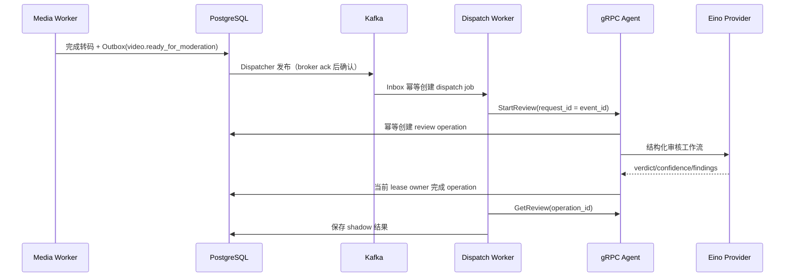

# Moderation Agent

Moderation Agent 是独立 Go gRPC 进程。它生成可审计的审核证据，但不拥有视频发布权限。默认运行在 `shadow` 模式；未配置模型供应商时返回 `escalate`，不会伪装成自动审核成功。

## 可靠链路



- `request_id` 是 Outbox event UUID；同 ID、同输入返回同一 operation，同 ID、不同输入返回冲突。
- operation 和 dispatch job 都使用 `FOR UPDATE SKIP LOCKED`、租约 owner、租约过期接管和有界失败预算。
- Provider 调用不发生在 Inbox 数据库事务内；Kafka 重投只会命中唯一 `event_id`。
- 旧 worker 失去租约后不能提交结果，避免覆盖接管者的证据。

## gRPC 契约

契约位于 `api/proto/sea_music/moderation/v1/moderation.proto`，通过 Buf STANDARD lint 和固定版本插件生成。

- `StartReview`：启动或幂等取得异步审核 operation。
- `GetReview`：查询 `pending/running/completed/failed/cancelled` 状态及结构化结果。
- gRPC health service 同时报告整体服务和 `sea_music.moderation.v1.ModerationService`。

模型结果中的 provider/model 字段由服务端写入，`policy_version` 来自已验证请求；`can_publish` 在领域层强制为 `false`。

## Eino provider

`SEA_MODERATION_PROVIDER=openai` 启用 CloudWeGo Eino 官方 OpenAI ChatModel 组件，也可通过 base URL 连接兼容服务。工作流是单次、确定边界的结构化分类，不使用自由 ReAct 循环。用户标题和描述以 JSON 不可信数据传入，提示词要求证据不足时升级人工；响应还会经过 Go 领域校验，非法 verdict、置信度或 finding 会 fail-closed 并进入重试。

当前 provider 覆盖标题和描述；source asset URI、类型与 SHA-256 作为证据引用，尚未下载视频并执行帧/音轨多模态分析。

## 运行与观测

```sh
SEA_AUTH_TOKEN_KEY=0123456789abcdef0123456789abcdef \
go run -buildvcs=false ./cmd/moderation-agent
```

默认端点：gRPC `:9090`，health/metrics HTTP `:9091`。Prometheus 中间件导出每个 RPC 的请求总数、状态码和 handling-time histogram；gRPC client/server 与 PostgreSQL 同时接入 OpenTelemetry。`make verify` 会真实启动 Agent，等待 readiness，走完整 Outbox→Kafka→Inbox→gRPC→结果落库链，并断言成功计数已采集。

本地开发默认 `SEA_MODERATION_INSECURE=true`。生产环境会拒绝 plaintext，必须配置 `SEA_MODERATION_TLS_CERT_FILE`、`SEA_MODERATION_TLS_KEY_FILE` 和 `SEA_MODERATION_TLS_CA_FILE`，服务端要求并验证客户端证书。
